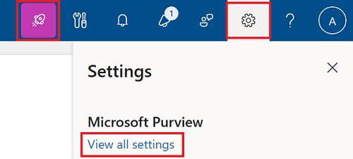
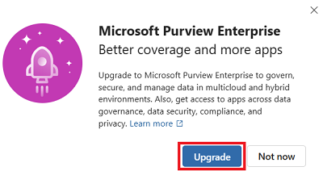
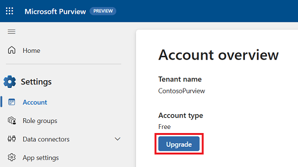
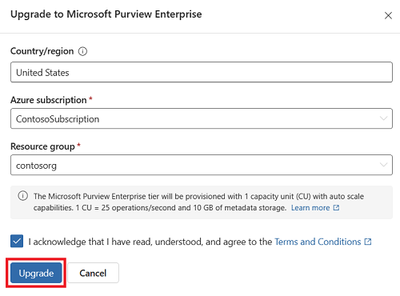
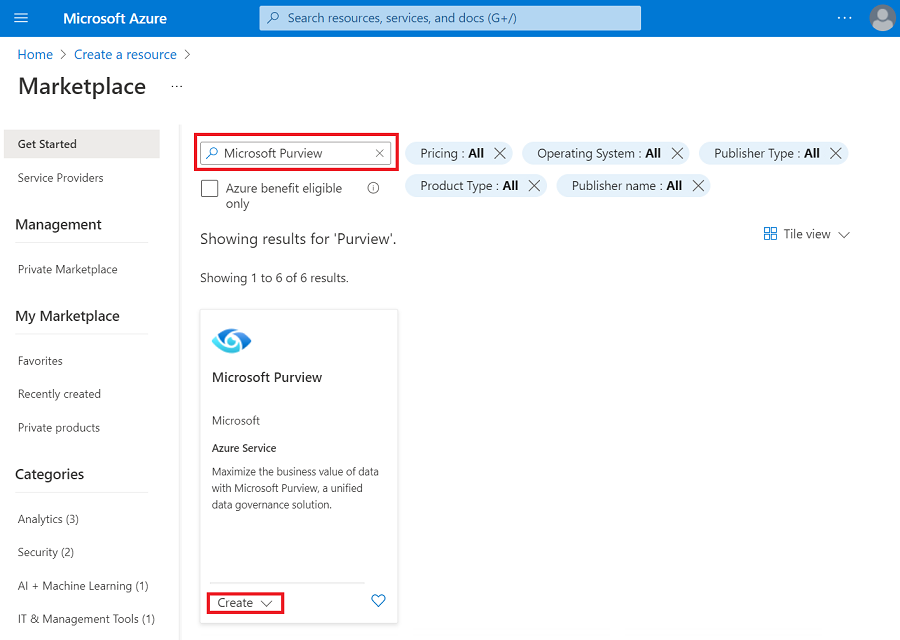
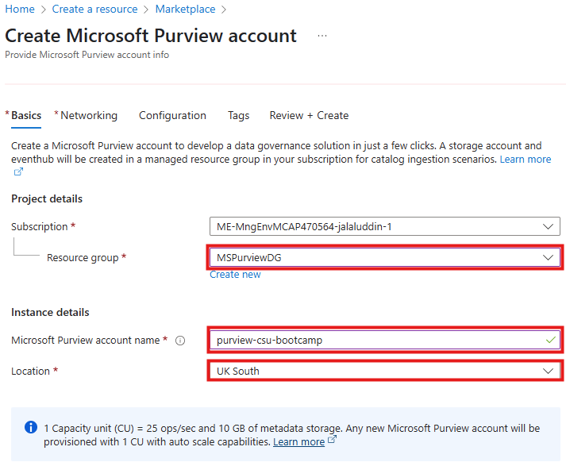
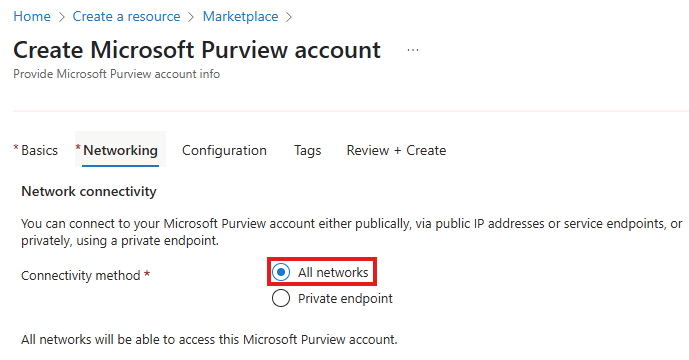
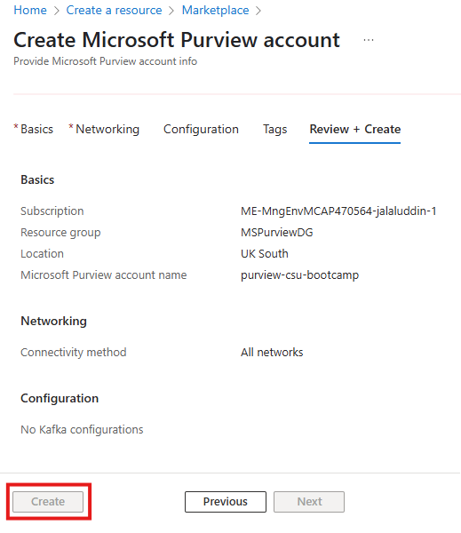

# Lab Setup - Module 01

**[Home](../README.md)** - [Next Module >](../modules/module02.md)

## Introduction

In this module, you'll learn how to set up a Microsoft Purview Data Governance (Enterprise) environment and deploy a sample Azure SQL database to act as your data source. This setup will form the foundation for exploring how Microsoft Purview connects to, scans, and catalogs data from your estate.

## Prerequisites

Before starting, make sure you have:

- An [Azure account](https://azure.microsoft.com/free/) with an active subscription.
- **Owner** permissions within a Resource Group.
- The following **resource providers** registered in your subscription:
  - Microsoft.Authorization
  - Microsoft.Purview
  - Microsoft.Sql
  - (Optional) Microsoft.DataFactory
  - (Optional) Microsoft.KeyVault

## Objectives

- Set up Microsoft Purview Data Governance (Enterprise) via one of two supported methods.
- Deploy a sample SQL data environment for use throughout the labs.

## Table of Contents

| # | Component                                                              | Description                                                             |
|---|------------------------------------------------------------------------|-------------------------------------------------------------------------|
| 1 | [Upgrade Microsoft Purview to Enterprise](#upgrade-microsoft-purview-to-enterprise) | Learn the two ways customers can enable Purview Enterprise              |
| 2 | [Deploy sample SQL environment](#deploy-sample-sql-environment)        | Use a script to provision a SQL Server and sample DB in your own tenant |

[Back to top](#lab-setup---module-01)

---

## Upgrade Microsoft Purview to Enterprise

If you've accessed [purview.microsoft.com](https://purview.microsoft.com), you've already seen the **free version** of Microsoft Purview. It supports many of the same data sources as the Enterprise version and is great for getting started with data governance.

However, the **Enterprise version** includes **advanced capabilities** designed for managing governance at scale, such as:

- **Automated Scanning** of the hybrid data estate 
- **Automated application** of classifications, glossary terms, and collections   
    and much more!

You can enable the Enterprise experience in two ways:
- **By upgrading your existing free Purview experience** from within Purview itself
- **By creating a new Purview account in Azure**

### Option 1: Upgrade from Microsoft Purview (Free)

_Reference: [Upgrade from Free to Enterprise](https://learn.microsoft.com/en-us/purview/data-governance-free-version-upgrade-to-enterprise)_

1. Go to [https://purview.microsoft.com](https://purview.microsoft.com)
2. Select the **Upgrade** button from the ribbon menu  
   

   
   - Alternatively, go to **Settings** → **View all settings**, then select **Upgrade**
   
     
3. Choose your Azure subscription and resource group
4. Accept the terms and conditions
5. Click **Upgrade**
   
   
6. Congratulations - you've upgraded!

---

### Option 2: Create a Purview Account in the Azure Portal

_Reference: [Create via Azure Portal](https://learn.microsoft.com/en-us/purview/legacy/create-microsoft-purview-portal)_

Creating a Purview account in your organisation for the first time will automatically provision the **Enterprise experience**. If you already have a purview account in your organisation, you will not be able to do this method and must consider option 1.

1. Go to [Azure Portal](https://portal.azure.com)
2. Search for **Microsoft Purview**
3. Click **Create** and provide the necessary details

   
4. Choose your Azure **subscription** and **resource group**  
5. Enter a **unique account name** and select **region** (e.g. UK South)  
   

6. Accept default **Networking** (All networks)  
   

7. Skip optional tabs (**Configuration**, **Tags**)

8. Click **Next: Review + Create**  

9. Click **Create**  
   
10. Congratulations - you have created a tenant level Purview Account (Enterprise)!

## Deploy Sample SQL Environment

Now that your Microsoft Purview Enterprise environment is ready, deploy a **sample SQL Server and database** to use throughout the labs.

This resource will serve as your example data source for cataloging.

Use the button below to launch the script:

---

## Summary

You’ve now:

- Enabled Microsoft Purview Data Governance (Enterprise) using one of two supported methods
- Deployed a sample SQL environment into your own Azure tenant

You're ready to begin exploring core Purview capabilities including cataloging, classification, and lineage.