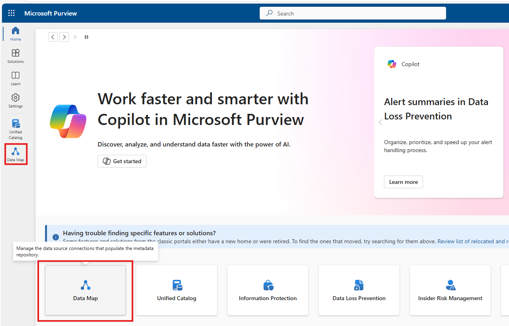
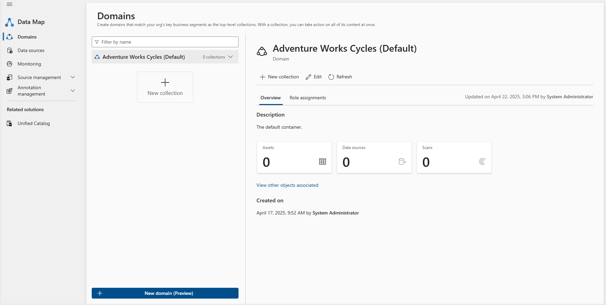
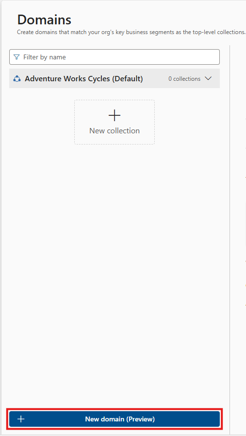
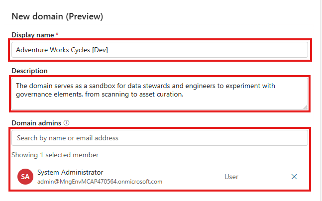
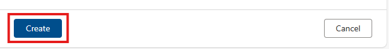
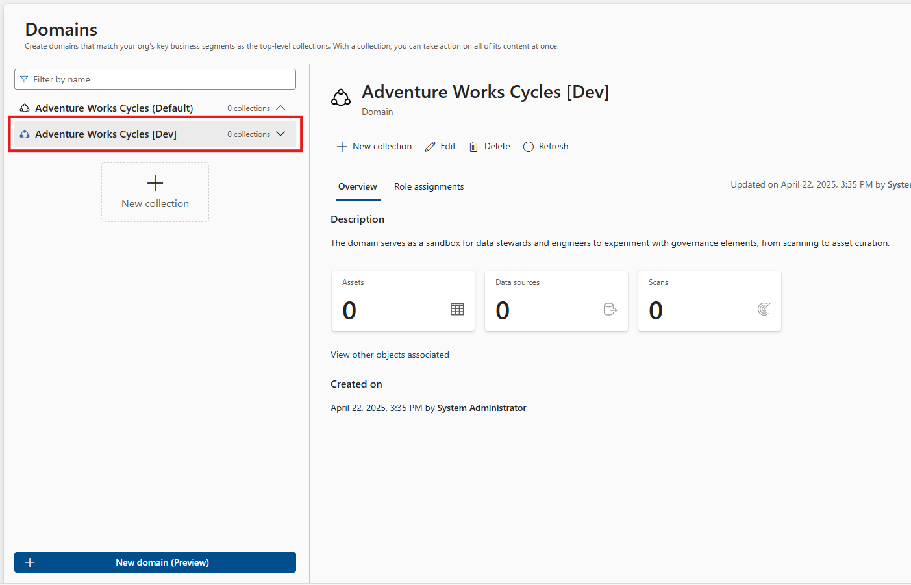
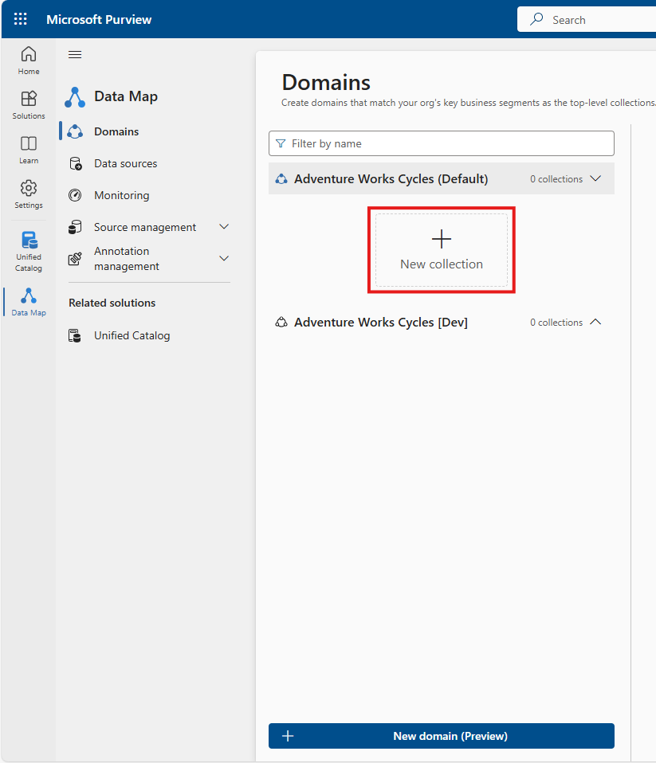
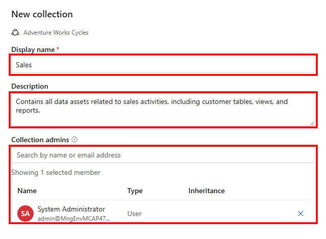
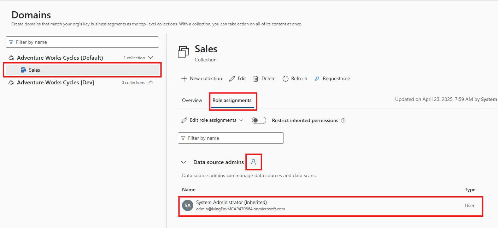

[< Previous Module](../modules/module01.md) - **[Home](../README.md)** - [Next Module >](../modules/module03.md)


# Module 2: Designing the Data Map

**⏰ Duration:** 30 minutes

---

## 📝 Introduction

In this module, you will design the Microsoft Purview Data Map — the foundation of your governance architecture. You will explore how to use **platform domains** and build a hierarchy of **collections** to organize your data sources. These structures define access boundaries and align your governance model with your organization's operational structure.

---

## ✅ Learning Objectives

By the end of this module, you will be able to:

- Explain the difference between platform domains and collections in Microsoft Purview.
- Identify when to create additional platform domains.
- Create and manage a collection hierarchy that reflects your governance structure.
---

## :bookmark_tabs: Table of Contents

| #  | Section | Role |
|----|---------|------|
| 1  | [Understand platform domains](#understanding-platform-domains) | Domain Admin |
| 2  | [Understand collections inside domains](#understanding-collections-inside-domains) | Collection Admin |
| 3  | [Explore platform domains](#️-exploring-platform-domains) | Domain Admin |
| 4  | [Create a collection](#-creating-collections) | Collection Admin |

---

## 📚 Concepts: Domains and Collections in Microsoft Purview

### Understanding Platform Domains  
_Source: [Microsoft Learn - Domains](https://learn.microsoft.com/purview/concept-domains)_

Microsoft Purview introduces **platform domains** to help distribute governance responsibilities across teams, departments, or environments.

> ⚠️ Do not confuse platform **domains** with **governance domains**, which are used to organize business glossary terms and data products.

Key facts:

- Every upgraded Microsoft Purview account starts with a **default domain** automatically.
- You can create up to **four additional domains** (five total) to support isolation between business units, subsidiaries, or environments.
- Domains define governance boundaries and contain collections, glossaries, and associated permissions.
- Each domain can have a dedicated **Domain Admin** role responsible for managing resources within it.

---

### Understanding Collections Inside Domains  
_Source: [Manage Domains and Collections](https://learn.microsoft.com/en-us/purview/how-to-create-and-manage-domains-collections)_

Collections are used to organize data assets, data sources, and scans within a domain. They define access control boundaries and follow a tree structure.

Collections act as containers for your assets - every data asset, source, or scan must reside within a collection. When you run a Purview scan, you are required to specify which collection the discovered assets will belong to. This helps keep your data organized and ensures access policies are consistently applied.

Key characteristics:

Hierarchical structure: Up to 8 levels deep, with a maximum of 256 collections per domain.

Role-based access control: Assign roles such as Collection Admin, Data Curator, and Data Reader.

Access inheritance: Permissions are inherited from parent collections by default but can be restricted.

Resource ownership: Assets and scans are associated with the collection in which they are registered.

---

# ⚙️ Exploring Platform Domains

By default, a `platform domain` is automatically created for every Microsoft Purview Data Map environment. This default domain is sufficient for most environments.

However, if your organization requires isolation across teams, subsidiaries, or deployment environments (e.g., dev/test/prod), you may create up to four additional domains.

---

## Steps to Create a New Domain

1. Open the Microsoft Purview portal and select `Data Map` from the left-hand navigation or from the central solution cards.  
   

2. On the `Domains` tab, you'll see your existing platform domains. By default, one domain (e.g., `Adventure Works Cycles`) will already be created.  
   

3. To create a new domain, click `+ New domain (Preview)` at the bottom of the Domains pane.  
   

4. In the `New domain` panel, fill in the name of your platform domain, description and domain admin. Good naming conventions and descriptions will help in the long run.

   **Display name**
   ```text
   Adventure Works Cycles [Dev]
   ```

   **Description**
   ```text
   The domain serves as a sandbox for data stewards and engineers to experiment with governance elements, from scanning to asset curation.
   ```
   
    **Domain admins**
   ```text
   admin
   ```
   

   Once you have filled out the details click `Create` to add the domain.

   

5. Take a moment to review your newly created platform domain. You can switch between domains by clicking on the text of the domain.  
   

> 💡 You only need to create additional domains if your organization requires distinct governance scopes. For many environments, the default domain is enough.

---

## 📂 Creating Collections

Now that you've reviewed your platform domain (or created a custom one, if needed), the next step is to begin structuring your governance environment by creating your first **collection** within that domain.

As mentioned earlier, collections allow you to group and manage data sources, scans, and assets in a structured and secure manner. Each domain starts with a root collection, and you can create sub-collections to reflect your business units, systems, or environments.

In this exercise, you'll create a new collection inside the **default domain**.

> For example, you might create collections named `HR`, `Sales`, or `CustomerInsights` to match internal ownership boundaries.

---

1. Go back to the **Domains** tab under the **Data Map**, if you are not already there.  

2. Click **+ New collection**.  
   

3. In the `New domain` panel, fill in the name of your collection, description and collection admin. Good naming conventions and descriptions will help in the long run.

   **Display name**
   ```text
   Sales
   ```

   **Description**
   ```text
   Contains all data assets related to sales activities, including customer tables, views, and reports.
   ```
   
    **Domain admins**
   ```text
   admin
   ```
   

   Once you have filled out the details, click on 'Create' to add the collection.

     

4. Take a moment to review your newly created collection. You can navigate to the **Role assignments** tab.  
   As the collection admin, you can assign additional roles - such as Data Curator, Data Source Admin, or Data Reader - to other users as needed to manage access and responsibilities effectively.  

   

> Collection roles can be added or updated at any time. Permissions are inherited by default from the parent collection but can be customized if needed.

---

## ✅ Summary

You have now designed the foundational structure of your Microsoft Purview Data Map using platform domains and collections. These components allow you to reflect your organization’s structure and governance model within the data catalog.

In the next module, you will register data sources and perform scans to populate your catalog with metadata.

👉 [Continue to Module 3: Managing Data Sources](../modules/module03.md)
