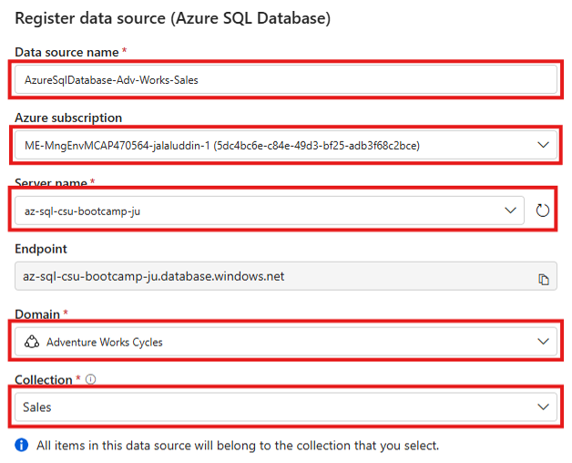
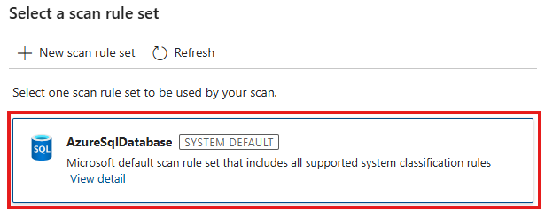

[< Previous Module](../modules/module02.md) - **[Home](../README.md)** - [Next Module >](../modules/module04.md)


# Module 3: Managing Data Sources

**⏰ Duration:** 45 minutes  
**🎩 Purview Solution:** Data Map  
**🌟 Outcome:** You will register one or more data sources, configure and run scans, and understand how scan rule sets, classifications, and integration runtimes enhance your metadata catalog.

---

## 📝 Introduction

In this module, you will extend your Microsoft Purview Data Map by registering data sources and configuring scans. You’ll also explore scan rule sets, classifications, and integration runtimes to ensure your catalog reflects an accurate, well-governed view of your data estate.

---

## ✅ Learning Objectives

By the end of this module, you will be able to:

- Register new data sources in Microsoft Purview.
- Configure data source scans and understand scan parameters.
- Explain the role of scan rule sets and classifications.
- Understand the different types of integration runtimes available.
- Monitor the status of scans using the Data Map solution.

---

## :bookmark_tabs: Table of Contents

| #  | Section |
|----|---------|
| 1  | [Registering Data Sources](#-registering-data-sources) |
| 2  | [Key Concepts Before Scanning](#-key-concepts-before-scanning) |
| 3  | [Configuring Scans](#-configuring-scans) |
| 4  | [Monitoring Scans](#-monitoring-scans) |

---

## 📄 Registering Data Sources

> Source: [Managing Data Sources](https://learn.microsoft.com/en-us/purview/manage-data-sources)

Before you can scan a data source, you must register it. Registration places the data source into a collection, defines its access boundary, and makes it visible in the Data Map.

> 💡 You need the **Data Source Administrator** role on the target collection to register a source.

---

### Steps to Register a Data Source

1. Open the **Microsoft Purview** portal and navigate to **Data Map > Data Sources**.  
   

2. Click **Register** to open the registration wizard.

3. In the **Register source** panel:

   - **Search for:**
     ```
     Azure SQL Database
     ```
     and click 'Continue'.

4. In the **Register data source (Azure SQL Database)** panel:

   - **Data source name:**  
     Choose a friendly and clear name that reflects the purpose of the source.  
     Example:  
     ```
     AzureSqlDatabase-Adv-Works-Sales
     ```

   - **Azure subscription:**  
     Choose the Azure subscription where your data source is hosted. You must have read-level access to it.

   - **Server name:**  
     From the dropdown, select the SQL Server that hosts your database. If it doesn’t appear right away, click the refresh icon 🔄 next to the dropdown.

     > 📝 If you’re unsure, confirm the server name in the Azure Portal under your SQL Server resource.

   - **Endpoint:**  
     This auto-fills after selecting the server. It usually follows the pattern:  
     ```
     <server-name>.database.windows.net
     ```

   - **Domain:**  
     Choose the **platform domain** where this source should live. This reflects a business area, environment (e.g. dev/test/prod), or geographical boundary.

   - **Collection:**  
     Select the **collection** within the chosen domain that aligns with the data source’s ownership or purpose.  
     Example:  
     ```
     Sales
     ```

     > 📁 All metadata from this data source will be stored in this collection.

   - 

5. Click **Register** to finish.

6. Review the newly registered source in the Data Map.  
   

> 🔹 Note: A data source can only be registered once. For shared assets, use a shared parent collection.

---

## 🧠 Key Concepts Before Scanning

Before running your first scan, it’s important to understand a few core concepts that influence how your metadata is captured and interpreted.

---

### 🔍 Scan Rule Sets

> Source: [Creating Scan Rule Sets](https://learn.microsoft.com/en-us/purview/create-a-scan-rule-set)

Scan rule sets define how the scanner behaves — what metadata to extract, what file types to include, and which built-in or custom classifications to apply.

> ✨ **Pro Tip:** You can create custom scan rule sets to exclude irrelevant file types or focus on business-specific data.

- Default rule sets cover common metadata patterns.
- Custom rule sets improve performance and reduce noise.
- Rule sets are domain-scoped and must be recreated per domain if needed.

---

### 🏷️ Classifications

> Source: [Concept - Classification](https://learn.microsoft.com/en-us/purview/concept-classification)

Classifications help detect sensitive or regulated data during scans. Purview includes 200+ system classifiers like:

- Government IDs (e.g., UK NI, US SSN)
- Financial data (e.g., credit cards)
- Personal information (e.g., phone numbers, emails)

> ✨ **Pro Tip:** Use **custom classifications** (e.g., regex or dictionary-based) to find business-specific formats like invoice numbers or product SKUs.

---

### 🔌 Integration Runtimes

> Source: [Choose the Right Integration Runtime](https://learn.microsoft.com/en-us/purview/choose-the-right-integration-runtime-configuration)

Integration Runtimes (IR) define how Microsoft Purview connects to your data sources.

| Type | Description |
|------|-------------|
| Azure IR | Default. Auto-managed for Azure sources. |
| Managed VNet IR | Auto-managed with secure VNet access. |
| Self-hosted IR | For on-premises or private sources. |
| Kubernetes IR (Preview) | Advanced AKS scenarios. |
| AWS IR | For AWS-native sources. |

---

## 🔢 Configuring Scans

> Source: [Register and Scan Overview](https://learn.microsoft.com/en-us/purview/register-scan-overview)

Once your data source is registered, the next step is to **configure and run a scan**. This process extracts technical metadata like table names, columns, and data types into the Data Map.

---

### 🔐 Authentication Options

| Method | Description |
|--------|-------------|
| **Managed Identity** | Uses Purview’s identity via Entra ID. | 
| **Service Principal** | Uses an Entra app + secret from Key Vault. |
| **SQL Auth** | Uses traditional SQL login (from Key Vault). | 

For this lab, we will go ahead and work with the Managed Identity for our authentication option.

> ⚠️ Managed identity doesn’t work with **self-hosted IR** — use SQL auth or a service principal instead.

---

### 🛠️ Grant SQL Access

Run the following in **Query Editor (preview)** in Azure SQL, using Entra ID login:

#### Minimum access for scanning:
```sql
CREATE USER [<your-purview-account-name>] FROM EXTERNAL PROVIDER;
GO

EXEC sp_addrolemember 'db_datareader', [<your-purview-account-name>];
GO
```

#### Optional: For lineage extraction:
```sql
CREATE USER [ms-purview-<your-purview-name>] FROM EXTERNAL PROVIDER;
GO

EXEC sp_addrolemember 'db_owner', [ms-purview-<your-purview-name>];
GO

CREATE MASTER KEY;
GO
```

- 


---

### Step 1: Create a New Scan

1. In **Data Map > Data Sources**, select your registered source.
2. Click **New scan**.
3. Fill in:
   - **Scan Name:**  
     ```
     az-sql-db-adv-works-sales-scan-001
     ```
   - **Integration Runtime:**  
     Choose **Azure Integration Runtime**.
   - **Database:**  
     Select your Azure SQL DB from the dropdown.
     ```
     az-sql-db-csu-bootcamp-ju
     ```
   - **Credential:**  
     Choose `Microsoft Purview MSI (system)`.
   - **Lineage extraction:** Toggle **On** (optional).
   - **Scan Level:** Auto detect.
   - **xEvent storage:** Use Microsoft-managed storage.
   - **Domain & Collection:** Your domain and collection details are auto-populated based on where the data source was registered.

   - 

---

### Step 2: Test Connection

Click **Test connection** to confirm the Purview identity has the required permissions.   


> ❗ If this fails, re-check the SQL permissions granted to the Purview identity.

---

### Step 3: Define the Scan Scope

After the connection is successfully tested, select the **scope** of your scan. This step determines which parts of the data source will be scanned — you can limit by schema or table.


> 🧠 **Why this matters:**  
> Scanning everything isn't always ideal — especially in large or sensitive environments. Narrowing the scope helps with performance, compliance, and clarity of results.
- ✅ **Best practice:** Usually you would start with a few key tables you are familiar with to verify everything is working correctly.
- 🔐 You might avoid scanning certain tables or views depending on your governance requirements.

---

### Step 4: Select Scan Rule Set

Start with the System Default rule set called AzureSqlDatabase, which includes all 209 system classification rules. You can create custom rule sets later if needed.



> 📌 **Why this matters:**  
> Rule sets guide what the scan should "look for" — such as specific file types or classifications. Microsoft Purview includes defaults, but you can tailor these to fit your needs.

- 🧰 **Default rulesets** are fine for most use cases.
- ⚙️ **Custom rulesets** let you exclude certain formats, or include custom classifications or optimise scan performance

---

### Step 5: Set Scan Trigger

Review when the scan should run.

- Select **once** for this lab.


> ⏱️ **Why this matters:**  
> Metadata can change over time. Regular scans help keep your catalog current without manual effort.

- 🧪 Use **Run once** for testing or a first-time scan.
- 🔄 Choose **Recurring** for ongoing visibility — e.g., every week or month.

---

### Step 6: Review and Run

Review your selections and click **Save and run**.


> 🚀 Congratulations, you have kicked off your first scan! Once complete, the discovered metadata will appear in your catalog under the collection where the data source was registered.
---

## 📊 Monitoring Scans

Each scan generates a unique run ID and status, viewable in the **Monitoring** tab.

Monitoring helps you validate that your scans are running as expected and identify any issues early on. This becomes especially important for scheduled (recurring) scans, where failures may go unnoticed unless monitored — and in environments handling sensitive data or supporting critical operations, where metadata freshness is tied to governance, compliance, or business continuity

### To monitor:

1. Go to **Data Map > Monitoring**.
2. Review key details:
   - **Status**: See if the scan succeeded or failed.
   - **Duration**: Check how long the scan took.
   - **Failure logs**: Use this for troubleshooting if the scan didn’t succeed.


> ↺ You can re-run scans or schedule recurring ones directly from the Monitoring tab.

Use this view to confirm that your metadata catalog stays accurate and up to date — a foundational step for governance, reporting, and data discovery.

---

## ✅ Summary

In this module, you:

- Registered a data source.
- Explored key scanning concepts: rule sets, classifications, runtimes.
- Configured and ran a scan.
- Viewed scan progress in the Monitoring tab.

👉 [Continue to Module 4: Governance Domains and Business Glossary](../modules/module04.md)

