# Module 4 - Curating Data Assets

[< Previous Module](../modules/module03.md) - **[Home](../README.md)** - [Next Module >](../modules/module05.md)

**⏰ Duration:** 20 minutes

**🎯 Outcome:** At the end of this task, you will have curated a sample of data assets from scans configured in [Module 3](). These assets will be enriched with descriptions, tags, classifications, and other metadata, providing additional context for end users to better consume and understand the data.

## :loudspeaker: Introduction

Once sources have been registered and scanned, the underlying catalog will begin to populate with assets that represent real-world objects (e.g. a table in an Azure SQL Database, a Power BI report, etc.) 

Data curation involves systematically organizing and managing data assets to ensure they are of high quality, accurate, and reliable. This process includes enhancing the data for presentation by adding metadata such as descriptions, tags, classifications, lineage information, etc. making the data more discoverable and usable for end users.

Given that data is generated across various areas of a business, it is crucial to consider the curation lifecycle before initiating the process. In this module, you'll learn the importance of data curation, including the process involved in organizing and managing data assets to ensure their quality, accuracy, and reliability. With this, you will learn how to enrich data with metadata such as descriptions, tags, classifications, lineage information, and owners, making the data more discoverable and usable for end users.

## :thinking: Prerequisites

* An [Azure account](https://azure.microsoft.com/free/) with an active subscription.
* A Microsoft Purview account (see [module 00](../modules/module00.md)).
* A completed scan on registered Data Sources (see [module 02](../modules/module02.md)).

## :dart: Objectives

* Search Unified Catalog for Data Assets.
* Browse by source.
* Update an existing data asset.

## :bookmark_tabs: Table of Contents

| #  | Section | Role |
| --- | --- | --- |
| 1 | [Search Unified Catalog]() | Data Reader |
| 2 | [Edit/Update an Asset]() | Data Curator |
| 3 | [Bulk edit]() | Data Reader |


<div align="right"><a href="#module-03---search--browse">↥ back to top</a></div>

## 1. Search Unified Catalog

1. Open the **Microsoft Purview Governance Portal**, navigate to **Unified Catalog** > **Discovery** > **Data assets**, type the asterisk character (**\***) into the search bar, and hit **Enter**.

    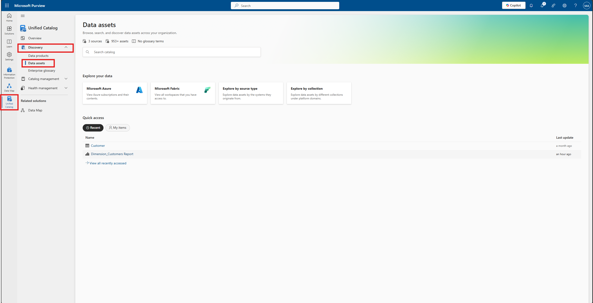

2. Filter the search results by **Data Source type** (e.g. **Azure SQL DB**), and click the hyperlinked asset name to view the details (e.g. `Customer`).

    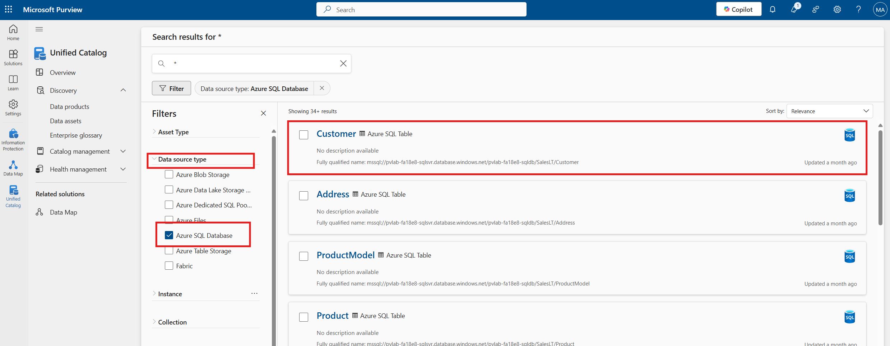

> :bulb: **Did you know?**
>
> While the **Microsoft Purview Governance Portal** is provided as the default user experience, customers and partners can interface with the underlying platform using the [Microsoft Purview REST API](https://docs.microsoft.com/rest/api/purview/). The openness of the platform enables the possibility of integrating Microsoft Purview with custom user interfaces as well as the ability to perform read/write operations programmatically.

<div align="right"><a href="#module-03---search--browse">↥ back to top</a></div>

## 2. Edit/Update an Asset

1. Click **Edit** to modify the asset details.

    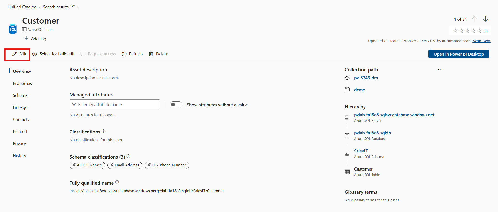
   
3. Update the **Description** by copying and pasting the sample text below.

    ```text
    The "Customer" table contains detailed information about customers. This table provides essential details about customers, including their contact information and the associated salesperson, which can be useful for customer relationship management and sales analysis.
    ```

    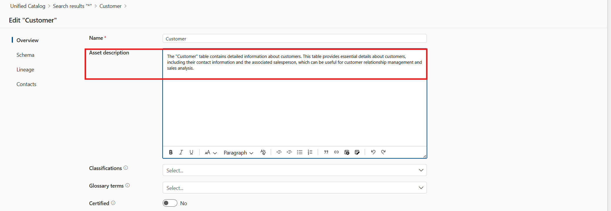

4. Assign a **Classification** (e.g. `All Full Names`) using the drop-down menu.

    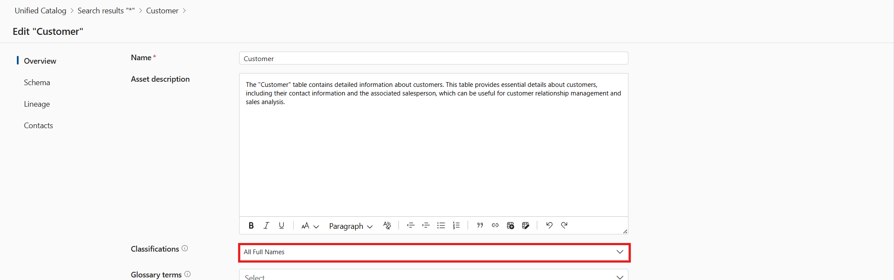
   
    > :bulb: **Did you know?**
    >
    > Microsoft Purview automatically applies **classifications** to some assets during the scanning process, but there are some scenarios when you may want to manually apply more classifications. For example, Microsoft Purview doesn't automatically apply classifications to table assets (only their columns), or you might want to apply custom classifications.

6. Navigate to the **Schema** tab and update the **Asset description** for each column using the sample text below.

    > :bulb: **Did you know?**
    >
    > **Classifications** and **Glossary Terms** can be assigned at the asset level (e.g. a Table within a Database) as well as at the schema level (e.g. a Column within a Table Schema).

    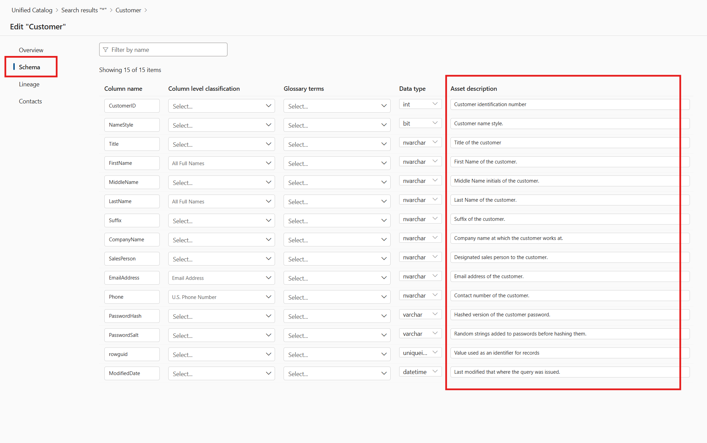

    **Customer ID**

    ```text
    Customer identification number.
    ```

    **Name Style**

    ```text
    Preferred customer name. If FALSE, it is unspecified.
    ```

    **Title**

    ```text
    Title of the customer.
    ```

    **First Name**

    ```text
   First Name of the customer.
    ```

    **Middle Name**

    ```text
    Middle Name initials of the customer.
    ```

    **Last Name**

    ```text
    Last Name of the customer.
    ```

     **Suffix**

    ```text
    Suffix of the customer.
    ```

     **Company name**

    ```text
    Company name at which the customer works at.
    ```

     **Sales Person**

    ```text
    Designated sales person to the customer.
    ```

    **Email Address**

    ```text
    Email address of the customer.
    ```

    **Phone**

    ```text
    Contact number of the customer.
    ```

    **Password Hash**

    ```text
    Hashed version of the customer password.
    ```

    **Password Salt**

    ```text
   Random strings added to passwords before hashing.
    ```

    **Rowguid**

    ```text
    Value used as an identifier of customer record.
    ```

     **Rowguid**

    ```text
    Value used as an identifier of customer record.
    ```

7. Navigate to the **Contacts** tab and set someone within your organization to be an **Expert** and an **Owner**. Click **Save**.

    > :bulb: **Did you know?**
    >
    > Assets can be related to two different types of contacts:
    >
    > * **Experts** are often business process or subject matter experts.
    > * Where as **Owners** are often senior executives or business area owners that define governance or business processes over certain data areas.
    >
    > For assets in which you are tagged as a **Contact**, these will appear on the home screen (Data catalog), under **My items**.

    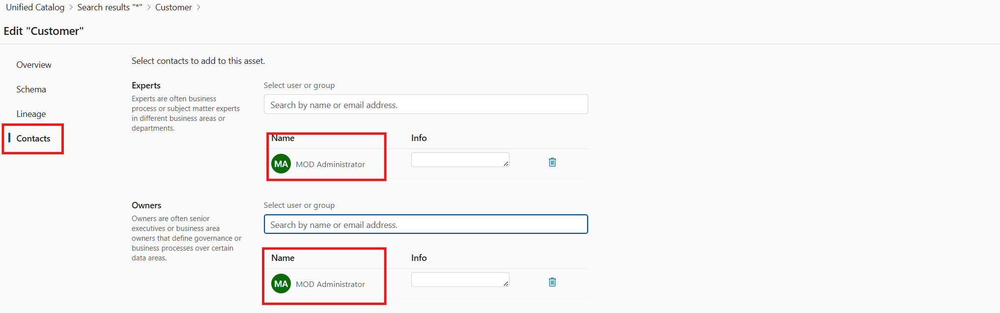

8. To see other assets within the same path, navigate to the **Related** tab.

    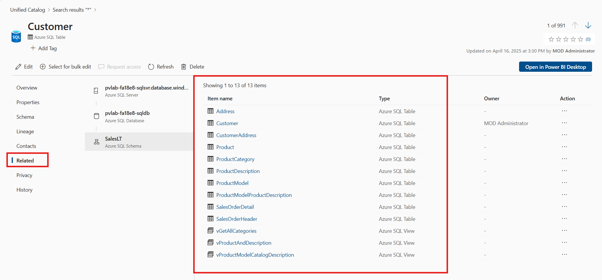

9. Let's add a few tags to the data asset. Click on **Add Tag**, and type in the following: **Customer**, **Customer_Contact**, **Customer_Information**

    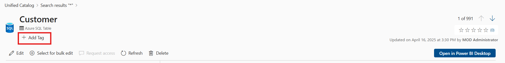

<div align="right"><a href="">↥ back to top</a></div>


## 3. Bulk Edit

Microsoft Purview allows us to perform certain operations (add/replace/remove) against a subset of attributes (Expert, Owner, Term, Classification, Certified) in bulk directly within the Microsoft Purview Governance Portal.

1. Open the **Microsoft Purview Governance Portal**, navigate to **Unified Catalog** > **Discovery** > **Data assets**, type the asterisk character (**\***) into the search bar, and hit **Enter**.

    

2. Filter the search results by **Data Source type** (e.g. **Azure SQL DB**), select the first five items in the search results, and click **View selected**.

    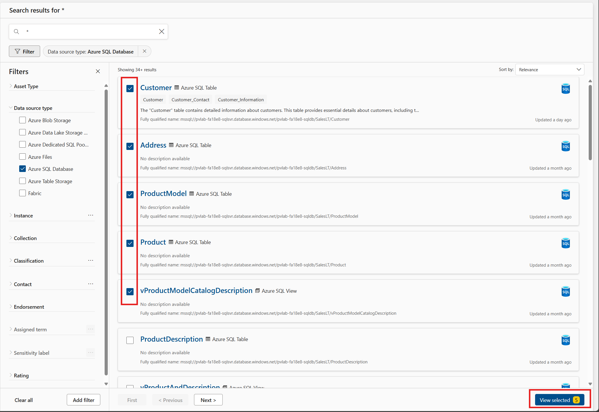

3. Click **Bulk edit**.

    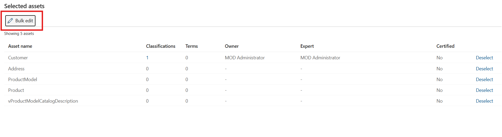

4. Set the **Attribute** to `Owner`, set **Operation** to `Add`, select one or more users in your organization, and click **Apply**.

    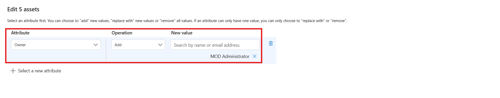

5. Click **Deselect all and close**.

    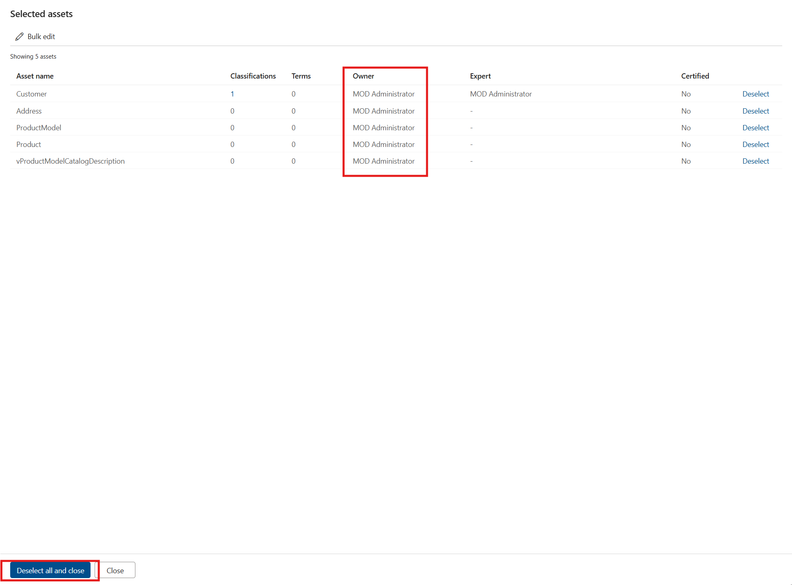

<div align="right"><a href="# Module 4 - Curating Data Assets">↥ back to top</a></div>

## :tada: Summary

This module provided an overview of how to search, browse, and update assets.

[Continue >](../modules/module05.md)
