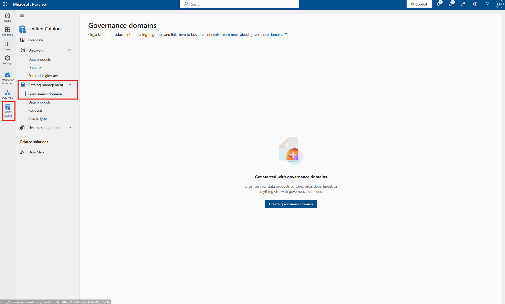
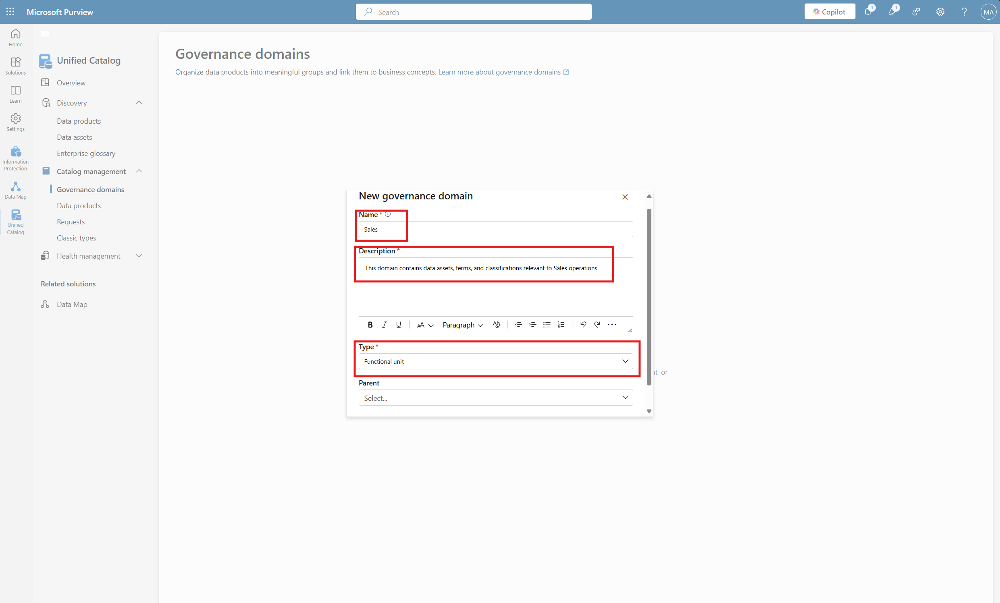
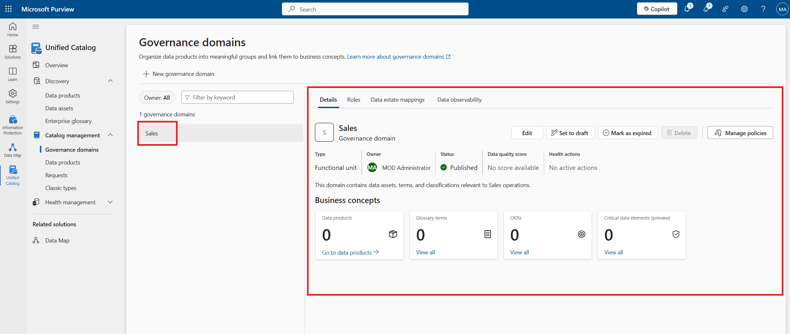

# Module 5 - Governance Domains

[< Previous Module](../modules/module04.md) - **[Home](../README.md)** - [Next Module >](../modules/module06.md)

**⏰ Duration:** 20 minutes

**🎯 Outcome:** At the end of this task, you will have created governance domains.

## :loudspeaker: Introduction

Governance domains in Microsoft Purview provide a structured way to group data assets based on business context—such as departments, data domains, or regulatory areas. They can be hierarchical, supporting up to five nested levels (e.g., a "Customer" domain with "Delivery" and "Experience" subdomains). Each domain can include owners, glossary terms, OKRs, and critical data elements, making it easier to align governance efforts with business priorities. By organizing metadata this way, Purview helps ensure scalable, discoverable, and well-governed data across the enterprise.

In this module, you’ll learn how to create and organize governance to further use them to enhance metadata searchability and clarity.

---

## :thinking: Prerequisites

* An [Azure account](https://azure.microsoft.com/free/) with an active subscription.  
* Microsoft Purview account (see [module 00](../modules/module00.md)).  

---

## :dart: Objectives

* Create and manage Governance Domains.  

---

## :bookmark_tabs: Table of Contents

| #  | Section | Role |
| --- | --- | --- |
| 1 | [Create Governance Domains](#1-create-governance-domains) | Data Steward |

---

## 1. Create Governance Domains

> Microsoft Purview Solution: Unified Catalog

1. Open the **Unified Catalog**, and go to **Catalog Management** > **Governance Domains**.

    

2. Click **Create governance domain**.

3. Fill out the domain details:

    - **Domain Name:** `Sales`  
    - **Description:** `This domain contains data assets, terms, and classifications relevant to Sales operations.`
    - **Type:** `Functional unit`  

    

4. Click **Create**. Your new **Governance Domain** will now appear in the list. Publish it, we will return to this once we have created a Data Product.

    

---

## :tada: Summary

In this module, you learned how to create and manage governance domains.

[Continue >](../modules/module06.md)

