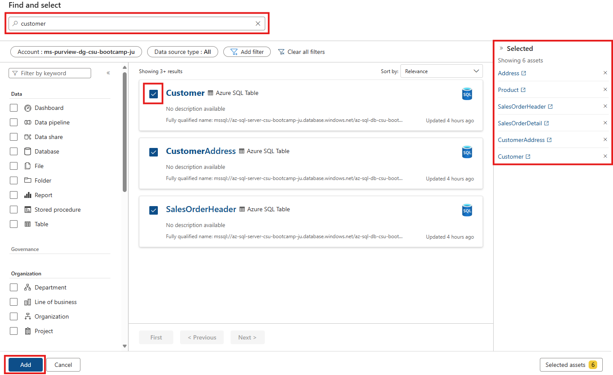

# 📦 Module 6 – Create and Manage Data Products

[< Previous Module](../modules/module04.md) - **[Home](../README.md)** - [Next Module >](../modules/module07.md)

## 📌 Introduction

This lab walks you through how to create a **data product** in Microsoft Purview's Unified Data Governance experience. Data products represent a business-friendly packaging of data assets, with descriptions, use cases, and access control to promote reusability, discoverability, and responsible access.

By the end of this lab, you will have created a data product, added assets to it, configured access policies, and published it.

---

## 🧠 Prerequisites

- An [Azure account](https://portal.azure.com) with an active subscription.
- A Microsoft Purview account.
- You are a **Data Product Owner** in at least one governance domain.
- Optional: Some curated data assets available in your catalog, such as the **AdventureWorksLT** dataset.

---

## 🎯 Objectives

- Create a data product.
- Enter relevant metadata including descriptions and business use cases
- Add underlying data assets.
- Define access policy rules and approvers.
- Publish the data product.

---

## 📚 Table of Contents

| #  | Section                                 | Role               |
|----|------------------------------------------|--------------------|
| 1  | [Start Creating a Data Product](#1-start-creating-a-data-product)         | Data Product Owner |
| 2  | [Add Basic Details](#2-add-basic-details)                   | Data Product Owner |
| 3  | [Define Business Use Case](#3-define-business-use-case)     | Data Product Owner |
| 4  | [Add Data Assets](#4-add-data-assets)                       | Data Product Owner |
| 5  | [Set Access Policy](#5-set-access-policy)                   | Data Product Owner |
| 6  | [Review and Publish](#6-review-and-publish)                 | Data Product Owner |

---

## 1. Start Creating a Data Product

1. Open the **Microsoft Purview Governance Portal**.
2. Navigate to `Catalog management` > `Data products`.
3. Select **+ New data product**.

- 

---

## 2. Add Basic Details

On the **Basic details** page, enter the following:

- **Name**: `Customer Order Summary`
- **Description**: `Combines customer, order, and product line item data from the AdventureWorksLT dataset. Designed to support analytics and reporting for sales performance, customer behaviour, and product demand across geographic regions.`

- **Type**: `Transactional dataset`

🧠 Why this is 'Transactional dataset':
The core tables in this data product (`SalesOrderHeader` and `SalesOrderDetail`) represent timestamped business events — customer purchases. Each row records details like product, quantity, and unit price, making this a classic transactional dataset. It is not a master list, model, or report — it's raw transactional data ready for analytical use.

- **Audience**: `BI Engineer`,`Data Analyst`, `Business User`, `Business Analyst`

🧠 The audience are the consumers. These people won’t necessarily manage or produce the data — that’s the owner/steward role — but rather consume or build insights from it.

- **Owners**: Assign yourself or a relevant Entra group (e.g., `Sales Analytics Team`)

- 

Click **Next**.

---

## 3. Define Business Use Case

On the **Business details** page:

- **Governance domain**: `Sales` (or another domain you’ve created)
- **Business use case**:
  > This data product supports cross-functional analytics for the sales and marketing teams. It enables:
  >
  > - Identifying top-spending customers  
  > - Analyzing seasonal trends and purchasing patterns  
  > - Generating regional sales summaries  
  > - Segmenting customers by product category  
  >
  > **Example Scenario**:  
  > A marketing analyst wants to find all orders placed by customers located in Washington state in the past 6 months, grouped by product.
  >
  > **SQL Behind the Scenes**:
  > ```sql
  > SELECT 
  >     c.CompanyName,
  >     p.Name AS ProductName,
  >     soh.OrderDate,
  >     sod.OrderQty,
  >     sod.LineTotal,
  >     a.StateProvince
  > FROM SalesLT.Customer AS c
  > JOIN SalesLT.SalesOrderHeader AS soh ON c.CustomerID = soh.CustomerID
  > JOIN SalesLT.SalesOrderDetail AS sod ON soh.SalesOrderID = sod.SalesOrderID
  > JOIN SalesLT.Product AS p ON sod.ProductID = p.ProductID
  > JOIN SalesLT.CustomerAddress AS ca ON c.CustomerID = ca.CustomerID
  > JOIN SalesLT.Address AS a ON ca.AddressID = a.AddressID
  > WHERE a.StateProvince = 'Washington'
  >   AND soh.OrderDate >= DATEADD(MONTH, -6, GETDATE())
  > ORDER BY soh.OrderDate DESC
  > ```

- (Optional) Check **Mark as Endorsed** if validated by governance stakeholders.

- 

Click **Create**.

🎉 Congratulations! You have successfully created your first data product. However, as it states, you must perform the next steps listed, 'Add data assets' and 'Set up a data access policy' before you can begin sharing (read Publish) with others.

---

## 4. Add Data Assets

1. In `Catalog management` > `Data products`, open the **Customer Order Summary** draft.
2. Scroll to the **Assets** section and select **Add data assets**.
- 
3. Use the search bar to locate and add the following assets:

| Asset Name             | Purpose                                 |
|------------------------|-----------------------------------------|
| `SalesOrderHeader`     | Order-level details with `CustomerID`   |
| `SalesOrderDetail`     | Line items, quantity, price             |
| `Customer`             | Customer metadata                       |
| `CustomerAddress`      | Customer-address mapping                |
| `Address`              | Location for segmentation (e.g., state) |
| `Product` *(optional)* | Product name and category               |

- Select each asset and add them by ticking the checkbox.

- 

---

## 5. Set Access Policy

1. Open your draft data product and click **Manage policies**.

Configure access as follows (mostly default values):

- **Permitted access**:
  - Usage purposes: `Assessing Fit`, `Critical Reporting`, `Directional Insights`
- **Access time limit**: `30 days`
- **Approval requirements**:
  - Require manager approval: `❌`
  - Require privacy review: `❌`
  - Approvers: Add individual(s) or group - `SalesGovernanceTeam@contoso.com`)
- **Access request approvers**: `Select an individual or teamresponsible for reviewing acccess requests`
  **Data Access provider**: `Select an individual or teamresponsible for provisoning accces.` 

- **Digital Attestations**:
  - Permit data copies: `✅`
- 

> 👀 **Preview the request form**  
> Use this option to see how the request experience looks to data consumers.

- 

Click **Save changes**.

---

## 6. Review and Publish

Once everything is configured:
  
- Assets ✅  
- Access Policy  

1. Return to the data product **Overview**.
2. Click **Publish** in the top-right corner.

- 

Your data product will now appear in the Unified Catalog and will be available for discovery and access requests.

- 

---

## 🎉 Summary

In this module, you:

- Created a data product draft
- Entered metadata and a real-world business use case
- Added curated AdventureWorksLT assets
- Configured access policies and previewed the request form
- Published the product for internal use

This approach ensures data consumers discover well-defined, governed, and business-aligned data products in the catalog.

---

[< Previous Module](../modules/module04.md) - **[Home](../README.md)** - [Next Module >](../modules/module07.md)
