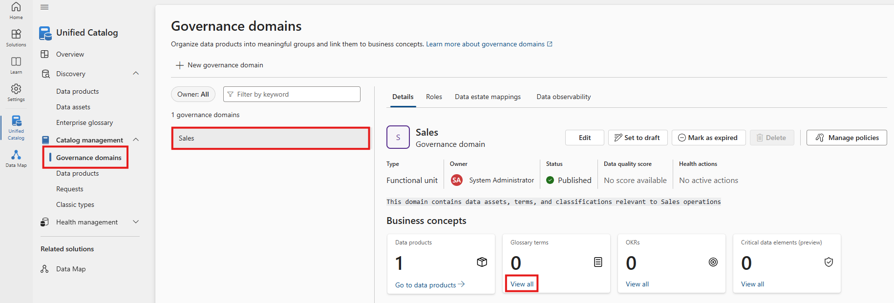
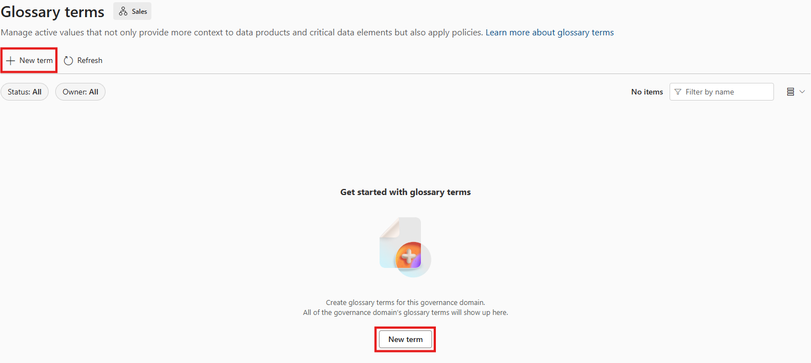
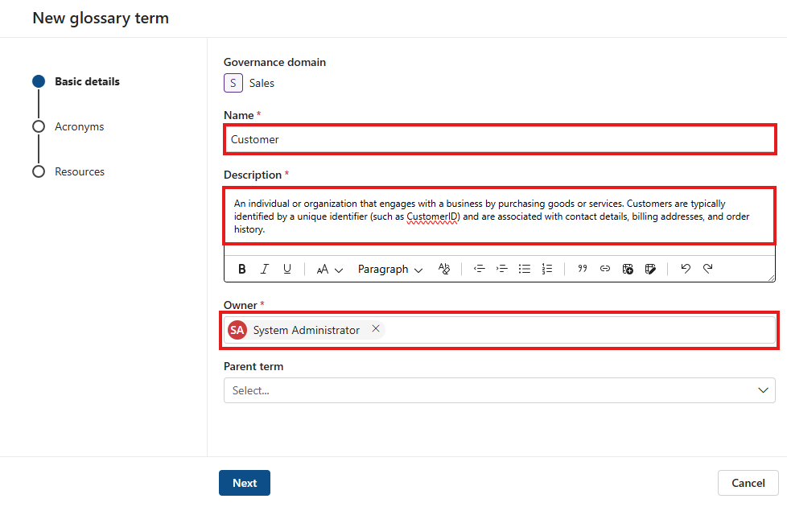
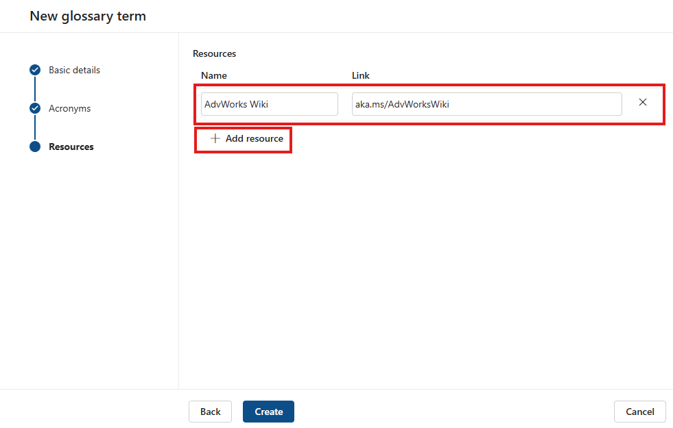
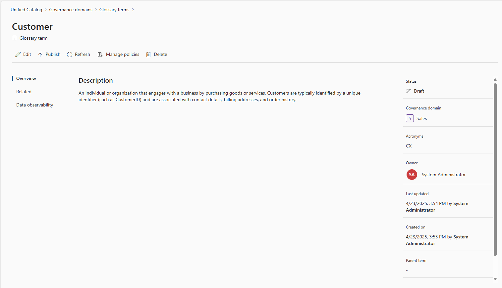
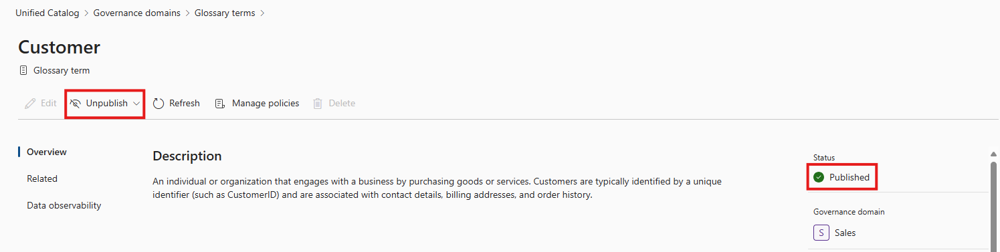
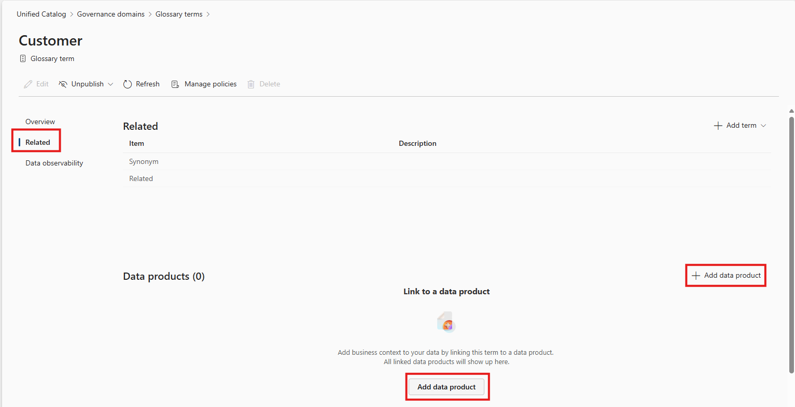
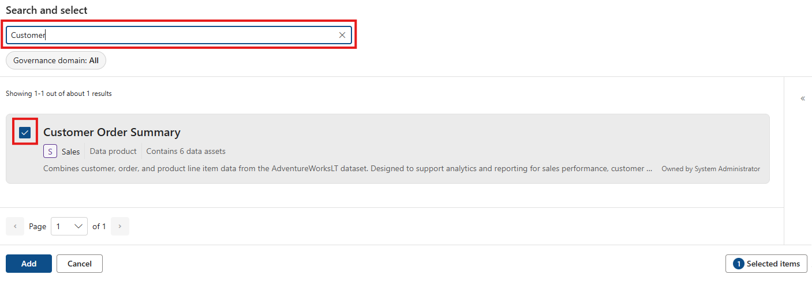
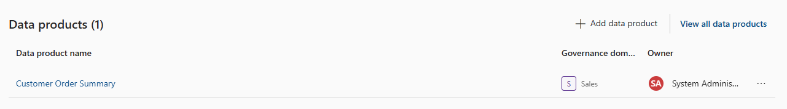
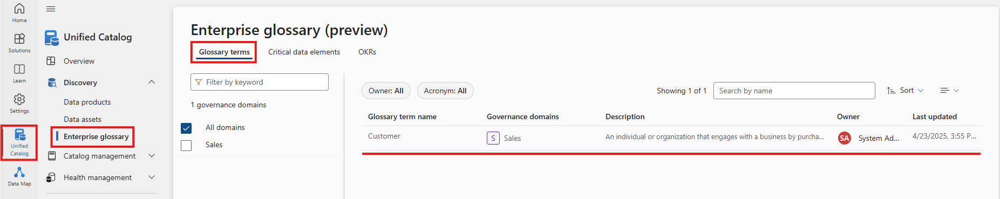

# 📘 Module 7 – Creating and Managing Glossary Terms and OKRs

[< Previous Module](../modules/module06.md) - **[Home](../README.md)** - [Next Module >](../modules/module08.md)

## 📌 Introduction

Glossary terms in Microsoft Purview Unified Catalog help establish a business vocabulary that supports data discovery, collaboration, and governance. These terms create a shared language between technical and non-technical users, enhancing clarity and trust.

In this module, you’ll learn how to create, publish, and manage glossary terms — and link them to relevant data products or assets using the **AdventureWorksLT** dataset as context.

---

## 🧠 Prerequisites

- Microsoft Purview account with Unified Catalog enabled
- Role: **Data Steward** (to create/edit glossary terms)
- Governance domains must be published before glossary terms can be published
- AdventureWorksLT database registered and scanned in Purview

---

## 🎯 Objectives

- View and browse glossary terms across domains
- Create a new glossary term for "Customer"
- Publish the term
- Link the term to data products
- Understand parent-child term hierarchy
- Search glossary terms as a catalog consumer

---

## 📚 Table of Contents

| #  | Section                                                           | Role          |
|----|--------------------------------------------------------------------|---------------|
| 1  | [Create the "Customer" Glossary Term](#1-create-the-customer-glossary-term) | Data Steward  |
| 2  | [Publish the Glossary Term](#2-publish-the-glossary-term)         | Data Steward  |
| 3  | [Link to Data Products](#3-link-to-data-products)                 | Data Steward  |
| 4  | [Search and Browse Terms](#4-search-and-browse-terms)             | All users     |

---

## 1. Create the "Customer" Glossary Term

> 📝 **Note**: You must have the **Data Steward** role to create glossary terms.

1. Open the **Microsoft Purview** portal.
2. Go to **Catalog management** > **Governance domains**.
3. Select the domain you'd like to add the term to (e.g., `AdventureWorksLT`).
4. Under the **Business concepts** section, find the **Glossary terms** card and select **View all**.
- 
5. Click **+ New term**.
- 
6. Fill in the form:
   - **Name**: `Customer`
   - **Definition**:  `An individual or organization that engages with a business by purchasing goods or services. Customers are typically identified by a unique identifier (such as CustomerID) and are associated with contact details, billing addresses, and order history.`  
   - **Owner(s)**: Search for `admin` and add yourself
   - (Optional) Add a **Parent Term** for hierarchy
   - 
   - Click Nex
   - Add **Acronyms**
   - **Acronym:** `CX`
   - 
   - Add **Resources** (useful links)
   - **Resources**: `aka.ms/AdvWorksWiki`
    - 
7. Click **Create**.

> 🔒 Your term is now in **Draft** state — only visible to stewards and domain owners.

- 

---

## 2. Publish the Glossary Term

Once your term is ready for broader visibility:

1. Open the glossary term (e.g., **Customer**).
2. In the top left corner, click the **Publish** button next to **Edit**.

> ✅ The term's status will change from **Draft** to **Published**, making it visible in the Enterprise Glossary (where consumers can search for business concepts like glossary terms and related assets).

- 

---

## 3. Link to Data Products

You can associate glossary terms with related data products:

1. Open the published glossary term.
2. Go to the **Related** tab.
3. Click **+ Add data product**.
- 
4. Search for and select published data products, such as:
   - `Customer Order Summary`
- 
5. Click **Add** to confirm.
- 

---

## 4. Search and Browse Terms

> This section is for **consumer** roles (e.g., analysts, data citizens).

1. In the **Microsoft Purview** portal, open **Unified Catalog**.
2. Under **Discovery**, select **Enterprise glossary**.
3. Use tabs like **Glossary terms**, **Critical data elements**, or **OKRs** to explore published concepts.
4. Search by term name or filter by domain, owner, acronym, etc.
5. Switch between **Compact list**, or **Tree** views to visualise parent/child relationships.

> 🔍 Unpublished parent terms won't appear in the tree view.

- 

---

## 🎉 Summary

In this module, you created and published a glossary term for **Customer**, linked it to data products, and explored how terms are discovered and browsed in Microsoft Purview.

Glossary terms help bridge the gap between business and technical users by defining shared meaning and improving data clarity across your organisation.

---

[< Previous Module](../modules/module06.md) - **[Home](../README.md)** - [Next Module >](../modules/module08.md)
