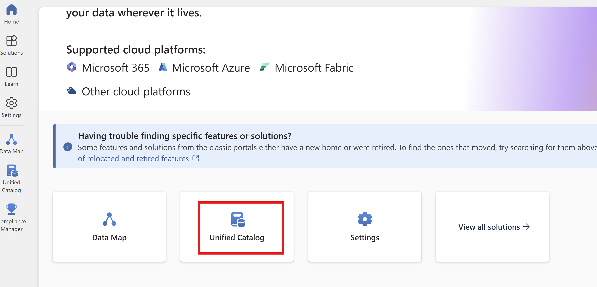
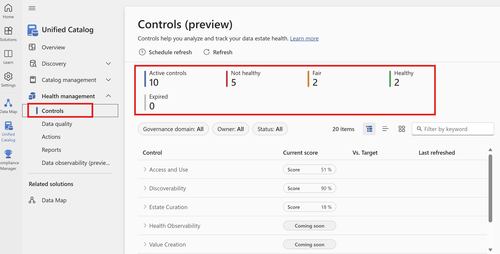
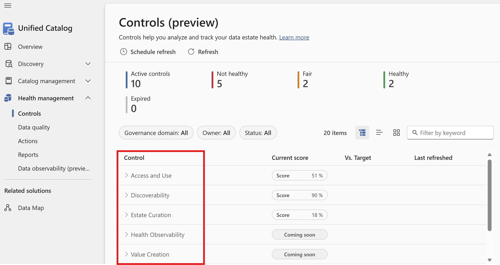
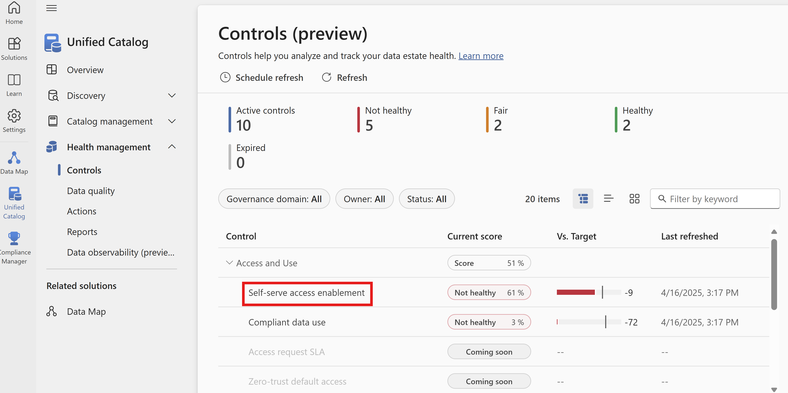
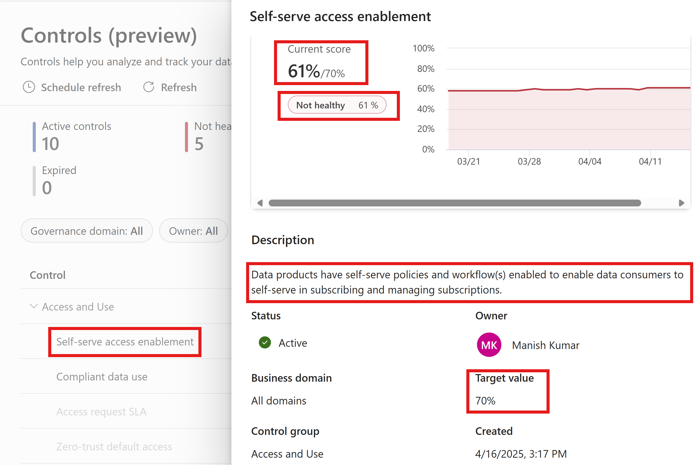
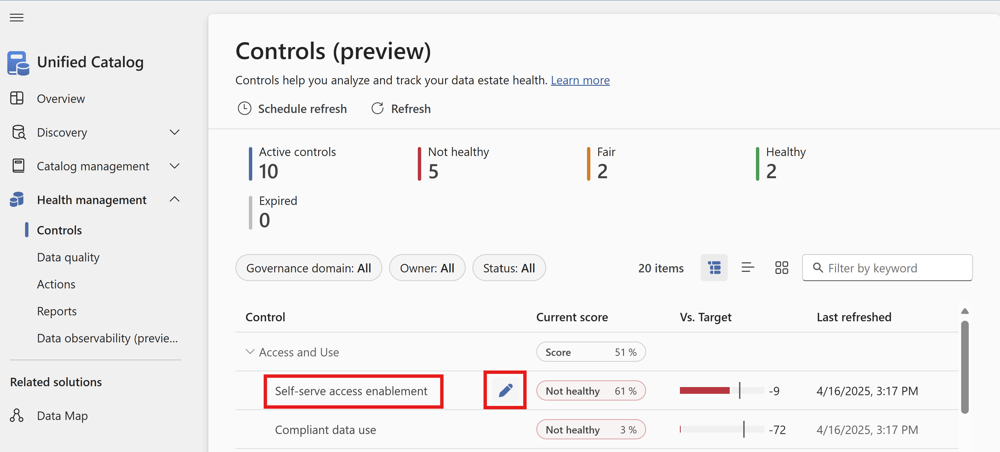
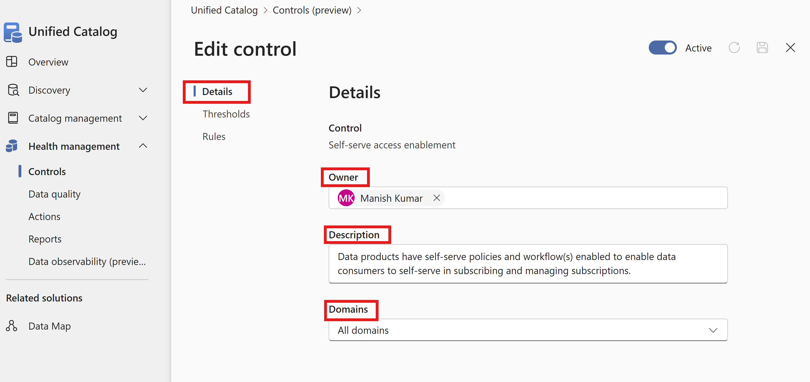
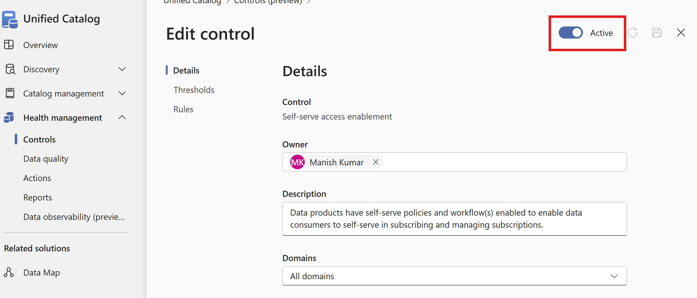

# Module 08 - Health Management Controls

[< Previous Module](../modules/module07.md) - **[Home](../README.md)** - [Next Module >](../modules/module09.md)

## :loudspeaker: Introduction

**What Are Health Controls?**
Health controls are essential tools and processes that help organizations monitor, maintain, and improve the quality, security, and usability of their data. They support the journey toward effective data governance by providing visibility into the current state of data health and enabling teams to track their progress.

These controls are a key part of a broader data governance framework, ensuring data remains accurate, consistent, and fit for purpose across the organization.

## :thinking: Prerequisites

* An [Azure account](https://azure.microsoft.com/free/) with an active subscription.
* A Microsoft Purview account (see [module 02](../modules/module02.md)).
* Set up and completed all previous modules.
* You need **data health reader** permissions to be able to view Data Estate Health information.
* You need **data health owner** permissions to be able to update or edit any health controls.

## :thinking: Limitations

* Custom controls can't be created as of April'2025.
  
## :dart: Objectives

* By the end of this module, you will have a solid understanding of the importance of data estate health and how Microsoft Purview provides tools to effectively manage and maintain it.

## :bookmark_tabs: Table of Contents

| #  | Section | Role |
| --- | --- | --- |
| 1 | [Review available health controls](#1-view-health-management-actions) | Data Health Reader |
| 2 | [Assign health management actions](#2-assign-health-management-actions) | Data Health Reader |
| 3 | [Change status health management actions](#3-change-status-health-management-actions) | Data Health Reader |

[↥ back to top](#module-10---health-management-actions)

## 1. Review available Health Controls

1. Open the **Microsoft Purview portal**,  and select **Unified Catalog**.

    

2. Select the **Health Management** drop-down, and  then select **Controls**. 
   
     

   On the main control page, you will see:
   * **Active controls** : The number of controls that are currently in place.
   * **Not Healthy** : The number of controls which are considered not healthy based on the health status rules that have been defined.
   * **Fair** : The number of controls which are considered fair based on the health status rules that have been defined.
   * **Healthy** : The number of controls which are considered healthy based on the health status rules that have been defined.
   * **Expired** : A Control can expired when it is not being evaluated or is no longer needed because it is always green. The control can be set to 'not active' which will expire it. This happens in the Health Control edit panel by flipping the active switch at the top (Data Health Owner Permission Needed)

              
3. **Understand Key Pillars for Data Estate Health**
With Health controls you can define and measure the vital signs of your data estate across the **eight key pillars** of data estate health:

  * **Access and Use**
Are appropriate policies and procedures in place to facilitate access to data and ensure its compliant use? For example, are self-service data access policies established, and are users required to declare the intended use of the data?

   * **Discoverability**
Are mechanisms in place to enable users to locate the data they need? To what extent have data products been made available, with relevant data assets properly mapped for user access?

   * **Estate Curation**
Are data products appropriately classified and labelled to support governance and usability?

   * **Health Observability**
Are effective tools in place to monitor the health of the data estate, and are these tools consistently utilized to drive improved outcomes?

   * **Value Creation**
Are data products aligned with business outcomes and delivering measurable value?

   * **Trusted Data**
Is data ownership clearly defined, and has the data been certified and subjected to quality checks?

   * **Metadata Quality Management**
To what extent are data products and assets well-described and documented?

   * **Data Quality Management**
What is the overall quality of the data in terms of accuracy, completeness, conformity, uniqueness, consistency, and timeliness?
     

4. The Health controls dashboard allows you to view your data estate health at a glance as a grid, a tree view or a chart view. You can also filter the controls by health status, Governance domain, owner or keyword.
   
Lets now **Review Control Details** by selecting one of the control group - In our example we will select **Access and Use Control group**.
   * **Locate the Control Group:** Navigate to any or all control groups one by one. In this example we will locate Access and Use Control group.

   * **Expand the Control Group:** Click the arrow next to the Control Group name to expand the list of available Controls within that group.

   * **Review indicators of all Controls under the Control Group:**  Take a note of the Current Score , vs Target and Last Refreshed date and time against each control within the control group **Access and Use** control group.
     

   * **Explore a Control:** Click on the name of the specific Control you want to view. In this example lets click on **Self-Serve access enablement**. 
     

    
* **Review Control Details:**
    Once selected, the Control details page will display following information, review and understand each one of them :

    * A graph showing the recent score trends
    * The Control description
    * Current health score and status
    * Linked governance domain
    * Owner
    * Control creation date

[↥ back to top](#module-08---health-management-controls)

## 2. Editing health controls

As a Data Health Owner, you have the ability to edit health controls to ensure they align with your organization's needs. You can:

   * Update the control’s description for clarity and context

  * Add or remove owners to maintain accurate accountability

 * Activate or deactivate the control as needed
  
  * Configure or adjust the target health status to match business objectives
  
  * Modify the domains included in the control’s calculation to refine its scope

**2.1 Edit control properties**
1. Hover over the control **Self-Serve access enablement** from a control group **Access and Use** and select the Edit pencil button as shown below :

    

2. Add or Edit owners to maintain accurate accountability.
   
3. Update the control’s description for clarity and context 
4. Modify the domains included in the control’s calculation to refine its scope
   

    

5. Click Save to save your changes
   
**2.2 Deactivating a Health Control**

To prevent a control from contributing new scores to its control group roll-up, you can deactivate it by following these steps:

1. **Toggle Active Status:**
Use the Active switch to change the control’s status to inactive (or re-enable it if needed).
2. **Save Your Changes:**
Click Save to apply and confirm the updated control status.

    

**2.3 Configure Control Thresholds**

To prevent a control from contributing new scores to its control group roll-up, you can deactivate it by following these steps:

1. **Toggle Active Status:**
Use the Active switch to change the control’s status to inactive (or re-enable it if needed).
2. **Save Your Changes:**
Click Save to apply and confirm the updated control status.

    

## :tada: Summary

This module provided an overview of how to use the Health Actions tool to manage the actions required to improve the health of your data estate.

[Continue >](../modules/module11.md)
