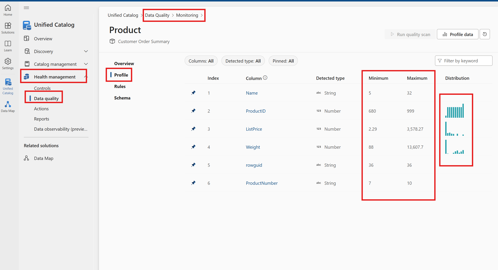
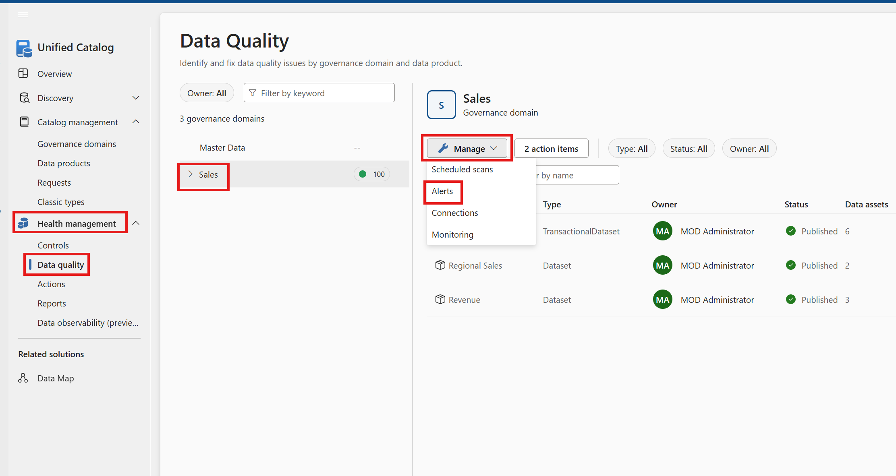

# Module 09 - Data Quality

[< Previous Module](../modules/module08.md) - **[Home](../README.md)** - [Next Module >](../modules/module10.md)

**⏰ Duration:** 30 minutes

## :loudspeaker: Introduction

 Data quality in Microsoft Purview Unified Catalog empowers governance domain and data owners to assess and oversee the quality of their data ecosystem, facilitating targeted actions for improvement. In today's AI-driven landscape, the reliability of data directly impacts the accuracy of AI-driven insights and recommendations. Without trustworthy data, there's a risk of eroding trust in AI systems and hindering their adoption.

 By applying data quality, organizations can effectively measure, monitor, and enhance the quality of their data assets, bolstering the reliability of AI-driven insights and fostering confidence in AI-based decision-making processes.

 Data Quality falls under **Health Management** section of Purview Unified Catalog

## :thinking: Prerequisites

* An [Azure account](https://azure.microsoft.com/free/) with an active subscription.
* A Microsoft Purview account (see [module 01](../modules/module01.md)).
* The source data assets have been scanned into the Purview Data Map (see [module 03](../modules/module03.md)).
* The relevant Governance domains have been defined (see [module 05](../modules/module05.md)).
* Data products have been created, linked to the source data assets (see [module 06](../modules/module06.md)).

## :dart: Objectives

* Understand the importance of Data quality, its lifecycle, setting up data quality rules, running data quality scan, review scan results and interpret data quality score

## :bookmark_tabs: Table of Contents

| #  | Section | Role |
| --- | --- | --- |
| 1 | [Data Quality Lifecycle](#1-data-quality-lifecycle) | Data Quality Steward |
| 2 | [Data Source Connection Configuration](#2-data-source-connection-configuration) | Read Access to Data |
| 3 | [Data Profiling](#3-data-profiling) | Data Quality Steward |
| 4 | [Data Quality Rules](#4-data-quality-rules) | Data Quality Steward |
| 5 | [Data Quality Scanning](#5-data-quality-scanning) | Data Quality Steward |
| 6 | [Data Quality Job Monitoring](#6-data-quality-job-monitoring) | Data Quality Steward |
| 7 | [Data Quality Alerts](#9-data-quality-alerts) | Data Quality Steward |

## 1. Data Quality lifecycle

Data quality life cycle consistes of the following steps:

1. **No need to follow this step, this is just for your information. You will already have the right access to the lab**. Assign users(s) data quality steward permissions in Unified Catalog to use all data quality features. Please refer this <https://learn.microsoft.com/en-us/purview/data-governance-roles-permissions#how-to-assign-catalog-level-roles/>

2. Register and scan a data source in your Microsoft Purview Data Map. **This step must have been performed earlier. If not, please follow the relevant module**

3. Add your data asset to a data product. **This step must have been performed earlier. If not, please follow the relevant module**
4. [Set up a data source connection to prepare your source for data quality assessment](#2-data-source-connection-configuration)
5. [Configure and run data profiling for an asset in your data source](#3-data-profiling)
6. Set up data quality rules based on the profiling results, and apply them to your data asset. [Data Quality Rules](#4-data-quality-rules)
7. Configure and run a data quality scan on a data product to assess the quality of all supported assets in the data product. [Data Quality Scanning](#5-data-quality-scanning).
8. Monitor [Data Quality Job Monitoring](#6-data-quality-Job-monitoring)
9. Review your scan results to evaluate your data product's current data quality

10. Repeat steps 5-8 periodically over your data asset's life cycle to ensure it's maintaining quality.

11. Continually monitor your data quality

12. Review data quality actions to identify and resolve problems

13. Set data quality notifications to alert you to quality issues.[Data Quality Alerts](#7-data-quality-alerts)

## 2. Data Source Connection Configuration

Data source connections set up the authentication needed to profile your data for statistical snapshot, or scan your data for data quality anomalies and scoring.j
To create connections to data assets, your users must be in the data quality steward role.
You need at least read access to the data source for which you are setting up the connection.

1. In Unified Catalog, select Health management, then select Data quality.
2. Select "Sales" governance domain from the list.
3. From the Manage dropdown list, select Connections to open connections page.

   

4. Select New to create a new connection for the data products and data assets of your governance domain.
5. In the right panel, enter the following information:
Display name
Description
6. Select Source type as "Azure SQL Database", and select "From Azure Subscription".
7. Select Subscription name, server name from the drop down list. Select "From Azure Subscription" for select database and select database name from the drop down list
8. Test Connection and if there is no error then "Submit". If there is any error then check the error and resolve it.
     
   
9. Now that the connection is created, to be able to scan data sources, your Microsoft Purview managed identity will need permissions on your data sources. To scan an Azure SQL database, assign db_datareader role to the Microsoft Purview Managed Identity. You can [follow the steps on the source page to assign managed identity permissions](https://learn.microsoft.com/en-us/purview/register-scan-azure-sql-database)

## 3. Data Profiling

Data profiling is the process of examining the data available in different data sources and collecting statistics and information about this data. Data profiling helps to assess the quality level of the data according to defined set of goals. If data is of a poor quality, or managed in structures that can't be integrated to meet the needs of the enterprise, business processes and decision-making suffer. Data profiling allows you to understand the trustworthiness and quality of your data, which is a prerequisite for making data-driven decisions that boost revenue and foster growth.

## Prerequisites

   1. To run and schedule data quality assessment scans, your users must be in the data quality steward role.
   2. Currently, the Microsoft Purview account can be set to allow public access or managed vNet access so data quality scans can run.

## Steps to configure data profiling Job

1. Configure a data source connection to the assets you're scanning for data quality if you haven't alrady done so.
2. From Microsoft Purview Unified Catalog, select Health Management, then select Data quality.
3. Select "Sales" governance domain from the list.
4. Select "CustomerOrderSummary" data product to profile a data asset linked to that product.
        
5. Select "Customer" data asset to navigate into data quality Overview page for profiling.
        
7. Select Profile button to run profiling job for the selected data asset.
        
8. The AI recommendation engine suggests potentially important columns to run data profiling against. You can deselect recommended columns and/or select more columns to be profiled.
    
9. Once you've selected the relevant columns, select Run Profile.

   
10. While the job is running, you can track its progress from the data quality monitoring page in the governance domain.

    
    
    
12. When the job is complete, select the Profile tab from left menu of the asset's data quality page to list browse the profiling result and statistical snapshot. There could be several profile result pages depending on how many columns your data assets have.
14. Browse the profiling results and statistical measures for each column.

## 4. Data Quality Rules

Data quality is the measurement of the integrity of data in an organization and is assessed using data quality scores. Scores generated based on the assessment of the data against rules that are defined in Microsoft Purview Unified Catalog.

Data quality rules are essential guidelines that organizations establish to ensure the accuracy, consistency, and completeness of their data. These rules help maintain data integrity and reliability.

Here are some key aspects of data quality rules:

**Accuracy** - Data should accurately represent real-world entities. Context matters! For example, if you’re storing customer addresses, ensure they match the actual locations.

**Completeness** - The objective of this rule is to identify the empty, null, or missing data. This rule validates that all values are present (though not necessarily correct).

**Conformity** - This rule ensures that the data follows data formatting standards such as representation of dates, addresses, and allowed values.

**Consistency** - This rule checks that different values of the same record are in conformity with a given rule and there are no contradictions. Data consistency ensures that the same information is represented uniformly across different records. For instance, if you have a product catalog, consistent product names and descriptions are crucial.

**Timeliness** - This rule aims to ensure that the data is accessible in as short a time as possible. It ensures that the data is up to date.

**Uniqueness** - This rule checks that values aren't duplicated, for example, if there's supposed to be only one record per customer, then there aren't multiple records for the same customer. Each customer, product, or transaction should have a unique identifier.

## Required roles

1. To create and manage data quality rules, your users must be in the data quality steward role.
2. To view existing quality rules, your users must be in the data quality reader role.

## Create a new data quality rules

1. From Microsoft Purview Unified Catalog, select the Health Management menu and Data quality submenu.
2. In the data quality submenu, select "Sales" governance domain.
3. Select "CustomerOrderSummary" data product.
   
4. Select "Customer" data asset from the asset list of the selected data product.
   
5. Select the Rules menu tab and select "New Rule".
   
6. Select "Empty/blank fields" and select "Next".
   
7. Select "Email Address" Column name from the dropdown list. Enter a Rule name and a description. Hit Create
   
 
 You have succesfully created a new data quality rule.

**Available data quality rules for information**

Microsoft Purview Data Quality enables configuration of the below rules, these are out of the box rules that offer low-code to no-code way to measure the quality of your data.

|Rule  | Definition|
| --- | --- |
|[Freshness](#freshness)|Confirms that all values are up to date.|
|[Unique values](#unique-values)|Confirms that the values in a column are unique.|
|[String format match](#string-format-match)|Confirms that the values in a column match a specific format or other criteria.|
|[Data type match](#data-type-match)|Confirms that the values in a column match their data type requirements.|
|[Duplicate rows](#duplicate-rows)|Checks for duplicate rows with the same values across two or more columns.|
|[Empty/blank fields](#empty-blank-fields)|Looks for blank and empty fields in a column where there should be values.|
|[Table lookup](#table-lookup)|Confirms that a value in one table can be found in the specific column of another table.|
|[Custom](#custom)|Create a custom rule with the visual expression builder.|
|[AI assisted autogenerated rules](#ai-assisted-autogenerated-rules)|AI-assisted automated rule generation for data quality measurement involves using artificial intelligence (AI) techniques to automatically create rules for assessing and improving the quality of data.|

## 5. Data Quality Scanning

Data quality scans review your data assets based on their applied data quality rules and produce a score. Your data stewards can use that score to assess the data health and address any issues that might be lowering the quality of your data.

## Prerequisites

1. To run and schedule data quality assessment scans, your users must be in the data quality steward role.
2. Currently, the Microsoft Purview account can be set to allow public access or managed vNet access so that data quality scans can run.

## Run a data quality scan

1. From Microsoft Purview Unified Catalog, select Health Management, then select Data quality.
2. Select "Sales" governance domain from the list.
3. Select "Customer Order Summary" product to assess the data quality of the data assets linked to that product.
4. Select the "Customer" data asset, which takes you to the data quality Overview page.
5. You can browse the existing data quality rules and add new rules by selecting Rules. You can browse schema of the data asset by selecting Schema. You can toggle on or off the rules already added.
6. Run the quality scan by selecting Run quality scan on the overview page.
 
   
   
7. While the scan is running, you can track its progress from the data [Data Quality Monitoring](#6-data-quality-job-monitoring) page

**Schedule data quality scans**
Although data quality scans can be run on an ad-hoc basis by selecting the Run quality scan button, in production scenarios it's likely that the source data is being constantly updated and, so we want to make sure we're regularly monitoring its data quality in order to detect any issues. To enable us to manage regularly updating quality scans we can automate the scanning process.

1. From Microsoft Purview Unified Catalog, select Health Management, then select Data quality.
2. Select "Sales" governance domain from the list.
3. Select Manage, then select Scheduled scans.
  

4. Fill out the form on the Create scheduled scan page. Add a name and description for the source you're setting up the schedule.
5. Select Continue.
 

6. On the Scope tab, select "CustomerOrderSummary" data product and "customer" asset within that data product.
7. Select Continue.
  
8. Set a schedule based on your preferences and select Continue.

9. On the Review tab, select Save (or Save and run to test immediately) to complete scheduling the data quality assessment scan.

You can monitor scheduled scans on the [Data Quality Monitoring](#6-data-quality-job-monitoring) page under the Scans tab.

## 6. Data Quality Job Monitoring

Data quality job monitoring enables data quality stewards to see the progress of data profiling, data quality rule generation, and data quality scanning jobs. Both manually configured and scheduled jobs' progress can be viewed from the data quality monitoring page.

## 7. Data Quality Alerts

Data quality alerts notify users about important events or unexpected behavior detected around the quality of the data. When you create alerts for assets, you'll receive email notifications about data quality scores.

To create data quality alerts, your users must be in the data quality steward role.

## Set data quality alerts

1. In Unified Catalog, select Health Management, then select Data quality.
2. On the Data Quality page, select a governance domain from the list.
3. From the Manage dropwdown list, select Alerts.
   
4. Select New to set up a new alert for the data products and data assets in your selected governance domain.
6. Enter a Display name and a Description.
7. For Target select any of the following options:
6.1. Score less than - trigger an alert if the assets' data quality score is less than certain percentage.
6.2. Score decreased by more than - trigger an alert if the current quality score drops by certain percentage after a new scan is run.
8. Select the threshold that will trigger an alert.
9. Select Turn on notifications for failed quality scan to enable alert notifications.
10. Add a Recipient to send the notification email to the recipient alias.

10. Select Continue to define the scope of alerts.
11. Under Scope, select data products and data assets that are being monitored through this alert and select Save button.

12. Select Continue to review.
13. Submit the alerts.

