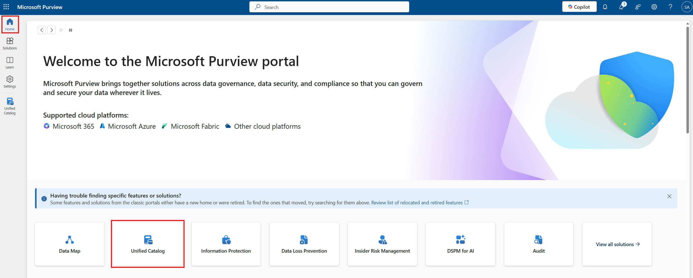
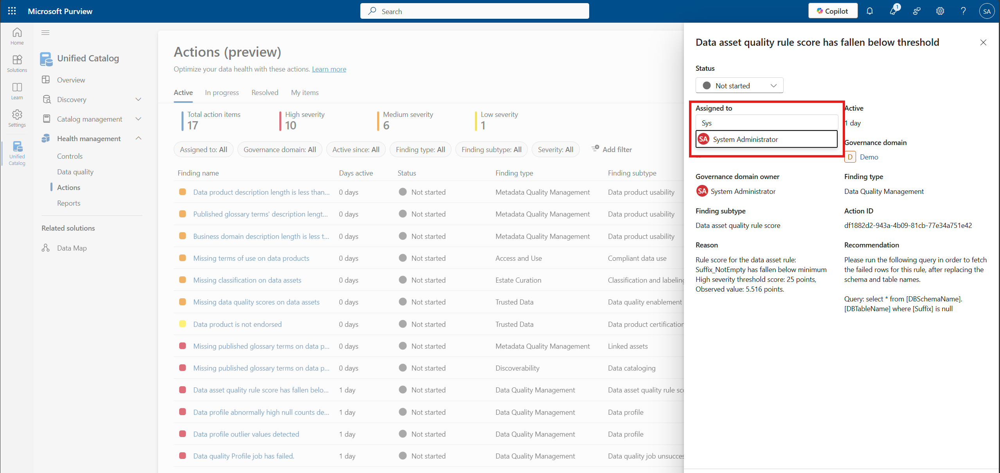

# Module 10 - Health Management Actions

[< Previous Module](../modules/module09.md) - **[Home](../README.md)** - [Next Module >](../modules/module11.md)

## :loudspeaker: Introduction

 Unified Catalog **Action** displays all health management actions related to catalog metadata, controls, and data quality. Health management actions give you and your users steps to take to improve data health and governance across your data estate.

## :thinking: Prerequisites

* An [Azure account](https://azure.microsoft.com/free/) with an active subscription.
* A Microsoft Purview account (see [module 02](../modules/module02.md)).
* Set up and complete a Health Control refresh (see [module 08](../modules/module08.md)).
* Set up and complete a Data Quality scan (see [module 09](../modules/module09.md)).

## :dart: Objectives

* Understand how to use Health Actions to address the findings of the Health Control rules, and Data Quality scans.

## :bookmark_tabs: Table of Contents

| #  | Section | Role |
| --- | --- | --- |
| 1 | [View health management actions](#1-view-health-management-actions) | Data Health Reader |
| 2 | [Assign health management actions](#2-assign-health-management-actions) | Data Health Reader |
| 3 | [Change status health management actions](#3-change-status-health-management-actions) | Data Health Reader |

[↥ back to top](#module-10---health-management-actions)

## 1. View health management actions

Using the Health Actions tool, to review the active Health Actions

1. Open the **Microsoft Purview portal**,  and select **Unified Catalog**.

    

2. Select the **Health Management** drop-down, select **Actions**

    

3. On the main actions page, where you can see: 
   * List of actions
   * How long they've been active
   * Target for the action
   * Owner

    

4. You can search by keyword, or filter these actions by many values, including: 
   * Assigned to
   * Governance domains
   * Active since
   * Action types, and more.

    

5. You can also group actions by selecting the Group by drop-down, to view actions by:
   * Severity
     * High
     * Medium
     * Low
   * Finding types and subtypes
   * Finding subtype
   * Finding name

    > Note: To reset the Group By select on of the Top Actions KPIs

    

[↥ back to top](#module-10---health-management-actions)

## 2. Assign health management actions

Select a health action and assign an action to a user

1. Go to one of the action for example "Data asset quality rule score has fallen below threshold", click on the name to see te details.

    

2. Assign the Health Action to a user by clicking in the 'Assigned to' field and start typing a name and select a user from the list.

    

## 3. Change status health management actions

Update the action's status to In Progress.

1. Set the status of the Health Action to In progress by clicking on the 'Status' field, and selecting "in progress" from the list of options.

    
    > Note: This is typically not an action you would do if you were assigning the action to someone else, as the action assignee would be responsible for updating the status.

2. Click on the Save button to complete the assignment and status update.

    

## :tada: Summary

This module provided an overview of how to use the Health Actions tool to manage the actions required to improve the health of your data estate.

[Continue >](../modules/module11.md)