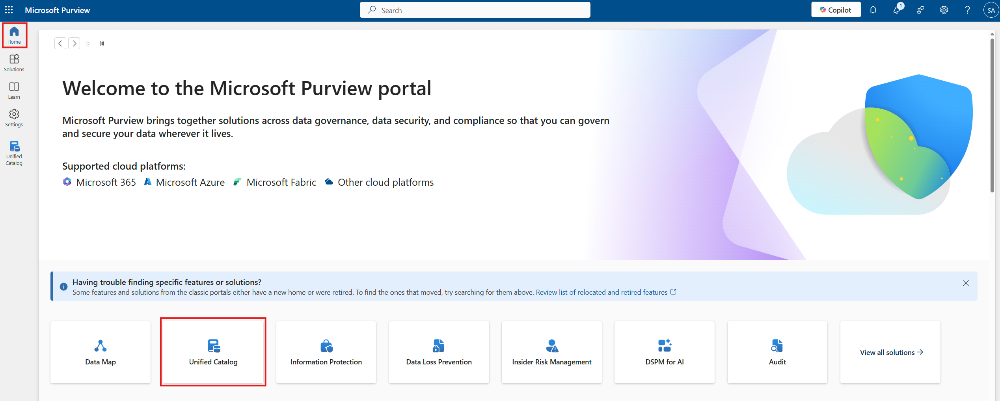
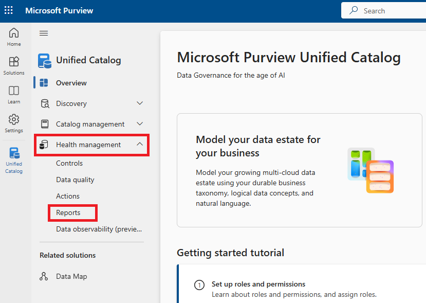
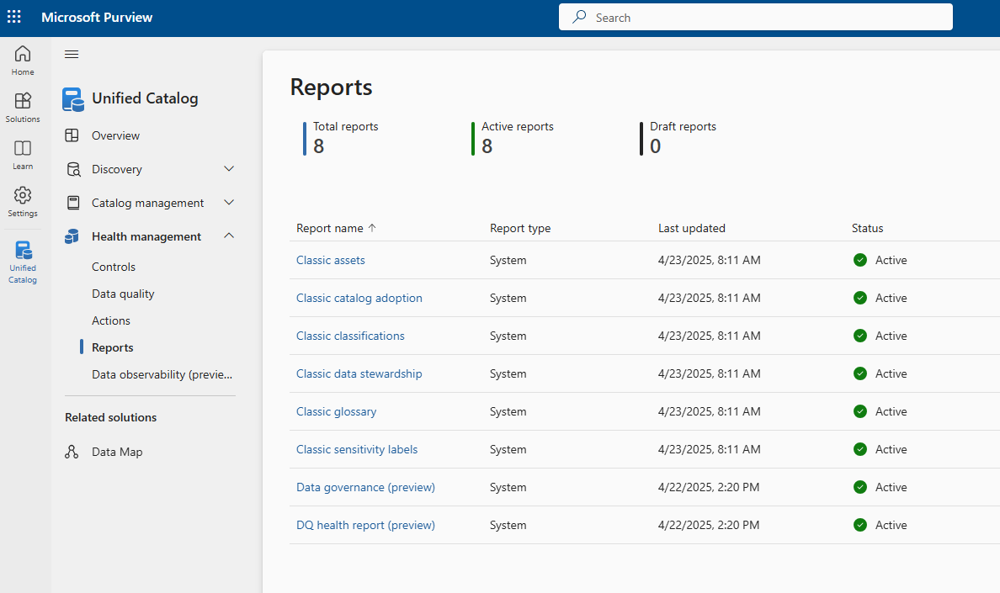
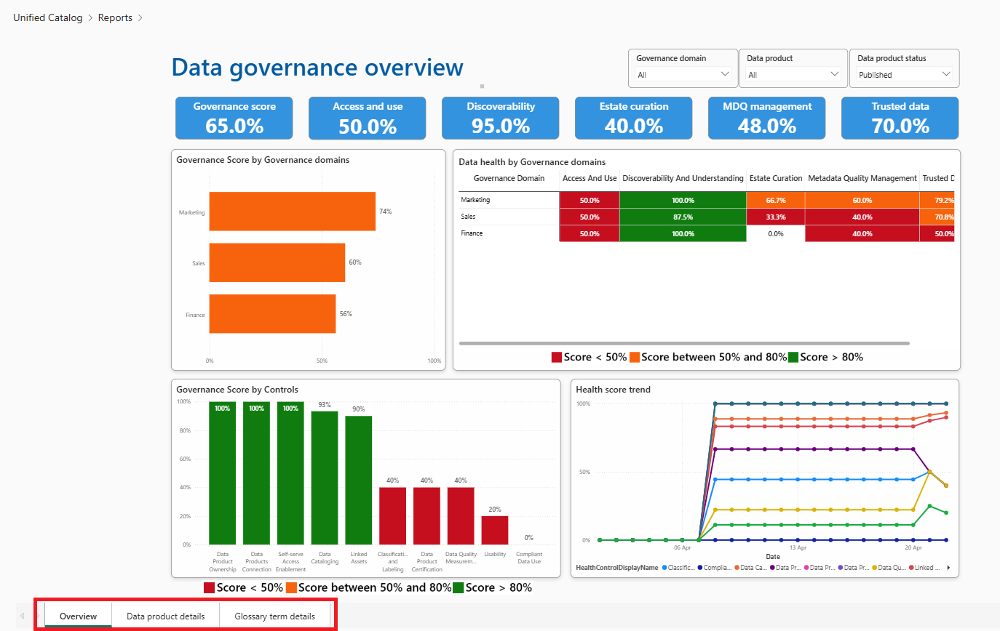
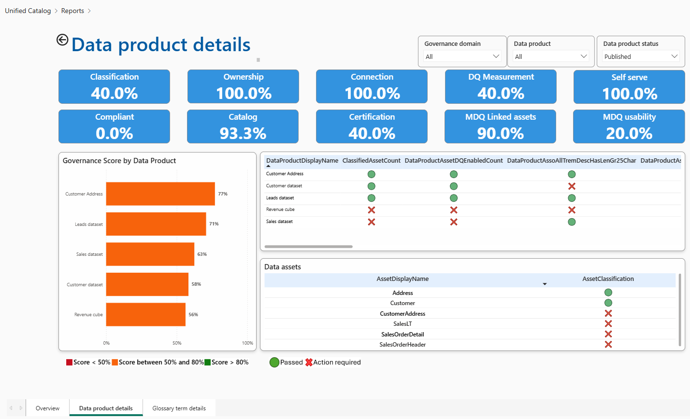
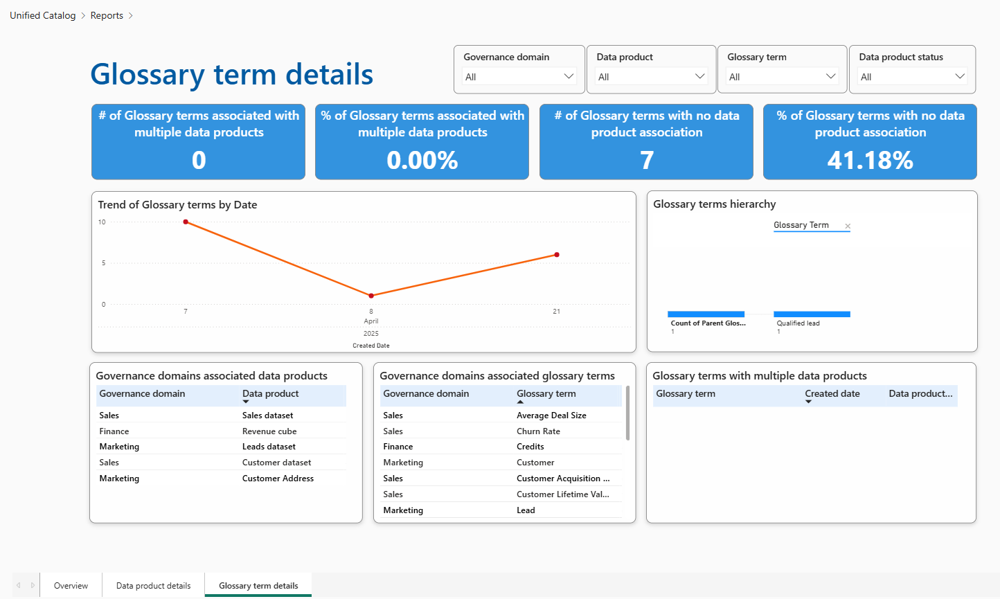
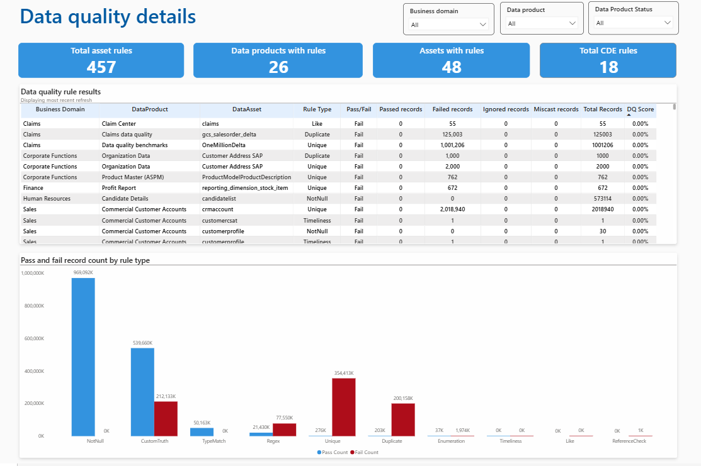
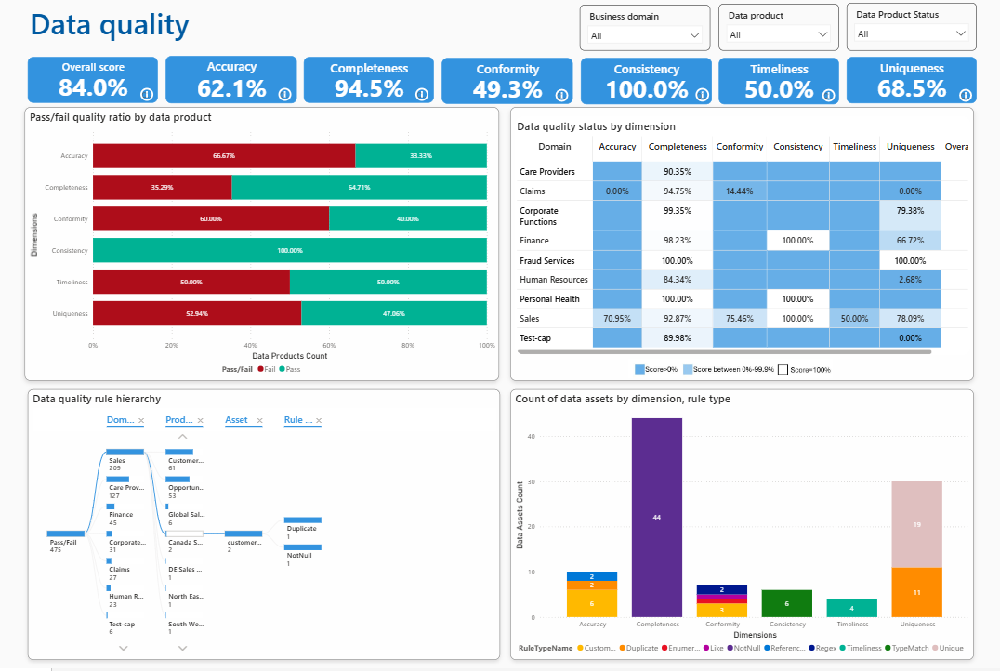

# Module 11 - Health Management Reports

[< Previous Module](../modules/module10.md) - **[Home](../README.md)**

**⏰ Duration:** 30 minutes

## :loudspeaker: Introduction

 Purview provides out-of-the-box reports to monitor and manage the health of your data estate, ensuring its quality, compliance, and usability. These reports provide actionable insights on areas to prioritize in improving the health of your data estate, and also facilitate tracking progress of improvements.

## :thinking: Prerequisites

* An [Azure account](https://azure.microsoft.com/free/) with an active subscription.
* A Microsoft Purview account (see [module 02](../modules/module02.md)).
* Set up and complete a Health Control refresh (see [module 08](../modules/module08.md)).
* Set up and complete a Data Quality scan (see [module 09](../modules/module09.md)).

## :dart: Objectives

* Understand the reports that are available out of the box and how to use them to improve the overall quality of your data estate.

## :bookmark_tabs: Table of Contents

| #  | Section | Role |
| --- | --- | --- |
| 1 | [View the data governance report](#1-view-the-data-governance-preview-report) | Data Health Reader |
| 2 | [View the data quality health report](#2-view-the-data-quality-health-preview-report) | Data Health Reader |

[↥ back to top](#module-11---health-management-reports)

## 1. View the **Data governance (preview)** report

1. Open the **Microsoft Purview portal**,  and select **Unified Catalog**.

    

2. Select the **Health management** drop-down, then select **Reports**

    

3. On the main Reports page, there are the following 8 reports:  
   * 6 classic reports, which are legacy reports that will be deprecated
   * Data governance (preview)
   * DQ health report (preview)

    

4. Select the **Data governance (preview) report**. This has three tabs:
   * Overview
   * Data product details
   * Glossary term details

    

5. Select the **Overview** tab.  

   The metrics at the top of the page provide a snapshot of the health of your data estate based on the controls configured for Access and Use, Discoverability, Estate Curation, MD Quality Management, and Trusted Data.  

   The **Governance score by governance domains** and **Data health by governance domain** visuals give a view of data health for all governance domains and highlight the controls to focus on improving.  

   The **Governance score by controls** visual highlights governance strengths and weaknesses by showing the overall score for each control. Prioritize controls with low scores to improve your data governance coverage across your data estate.  

   The **Health score trend** visual shows daily health progression for all of the main health controls. It can be used to track progress.

    This report can be filtered by governance domain, data product and data product status.

6. Select the **Data product details** tab

      

    The Data product details page shows action and control information for data products. The visuals on the page are:
    * Cards that show overall governance health, covering both controls and actions
    * **Governance score by data product** ranks data products by their governance scores
    * **Individual control checks**. This table shows the pass/fail status for each individual control check available to your data product. You can check controls for low-scoring data products to see which areas will need improvement.
    * **Data assets**. This table shows the pass/fail status for individual assets in Unified Catalog. If a single asset is referenced by multiple data products, resolving any outstanding governance issues for that asset could have a greater impact.  

7. Select the **Glossary term details** tab

    

    The glossary terms report gives more insight into glossary terms and their association with domains and data products. Its shows:
    * Glossary terms added by date
    * Glossary terms hierarchy
    * Glossary terms associated with domains
    * Glossary terms with associated with multiple data products

[↥ back to top](#module-11---health-management-reports)

## 2. View the **Data quality health (preview)** report

Select **Reports**, then **DQ health report (preview)**. The Data Quality (DQ) report evaluates and summarizes the quality of data. It includes assessments of the various data quality dimensions to give a view of the accuracy, completeness, consistency, reliability, and timeliness of data.

1. Select the **Overview** tab.

    

    The visuals on the **Overview** page are:  

    * At the top, there are cards showing the overall data quality score and individual dimension scores
    * **Pass/fail quality ratio by data product**. This helps with understanding what percentage of data in a data product is inaccurate, inconsistent, incomplete, duplicate, or not fresh enough as expected.
    * **Data quality status by dimension**. Data quality dimensions scores are shown for each governance domain.
    * **Data quality rule hierarchy**. This allows you to view the breakdown of Pass/Fail rates by domain, data product, data asset and rule type.
    * **Count of data assets by data assets, rule type**

2. Select the **Details** tab.  

    

    The data on this tab helps you to understand what data quality rules are applied to data products, data assets, and critical data elements, as well as the rules where there are failures.You can filter the measures by governance domain and data product to understand the current state and to plan improvement actions.  

## :tada: Summary

This module provided an overview of how to use the reports available in Purview to gain insights into the health of your data estate.
